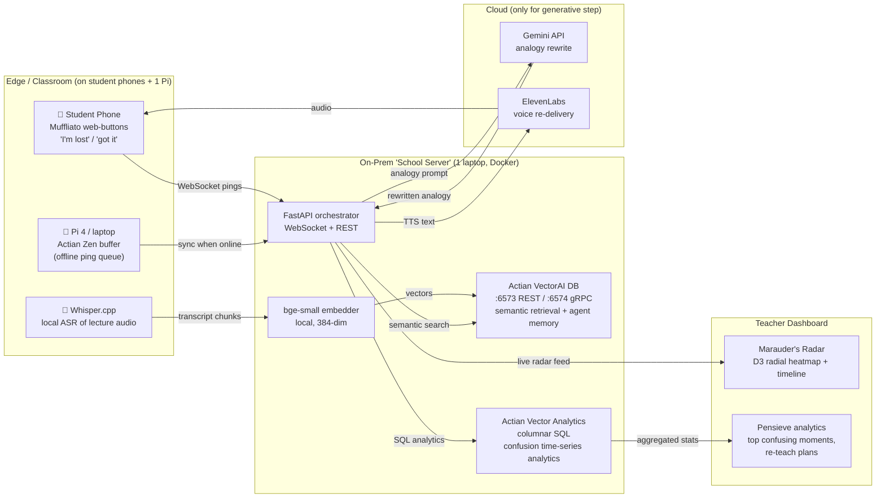

# Legilimens — Full Build Blueprint for HexaFalls 2

A real-time "mind-reading" layer for live classrooms: it detects *where* and *when* students collectively get lost, then instantly re-explains that exact moment using a freshly-generated analogy pulled from each student's own interest graph — with all retrieval running on-prem on Actian VectorAI DB so student data never leaves the building. Below is the complete spec: concept, architecture, Actian integration, tech stack, hour-by-hour plan, role split, demo script, and a judge's-eye self-audit.

**Verified technical grounding:** Actian VectorAI DB ships as a single Docker container, exposes REST on port 6573 / gRPC on 6574, needs no auth for local dev, has official Python (`actian_vectorai`) and JavaScript SDKs, LangChain/LlamaIndex integrations, and is purpose-built for air-gapped/edge RAG with no per-query fees or data egress【turn1fetch1】【turn1fetch0】【turn0search0】. Actian Vector (Analytics Engine) is an in-memory columnar SQL DB with ODBC/JDBC/Python-UDF access, available as a community Docker image (`actian/vector5.0:community`)【turn1search9】【turn1search8】. This is the stack we build on.

---

## 1. Concept & Narrative (the Hogwarts skin that earns thematic points)

The hackathon is fully Harry-Potter-themed and judges reward coherence【turn0fetch0】. Legilimens is the "mind-reading" spell — perfectly on-brand for a system that reads collective confusion. Frame every component with a spell name:

| Component | Spell name | Purpose |
|---|---|---|
| Confusion capture agent | **Muffliato** | Quietly listens to "I'm lost" pings without disrupting class |
| Real-time radar viz | **Marauder's Radar** | Shows where minds are wandering, live |
| Retrieval engine | **Accio Analogy** | Summons the best past explanation from the school's knowledge vault |
| Analogy rewriter | **Gemino** | Duplicates & reshapes the explanation in the student's language |
| Voice re-delivery | **Sonorus** | Speaks the analogy back, calmly |
| Teacher analytics | **Pensieve** | Re-view the lecture's worst moments and re-teach plans |

One-line pitch for judges: *"Professors, you've all taught a room where 40% silently drowned — and you never knew. Legilimens is the radar that catches it, and the spell that fixes it, in under a second, on the school's own server."*

---

## 2. System Architecture



The defining structural choice: **the entire student-data path (capture → embed → retrieve → analytics) lives inside the "school server" laptop.** Only the final analogy rewrite + voice cross the network, and that payload is anonymized text. Pull the Ethernet cable and the radar, retrieval, and analytics still work — that's the Actian edge thesis made physical【turn0search0】.

---

## 3. Component-by-Component Specification

| Layer | Component | Responsibility | Key tech |
|---|---|---|---|
| Capture | Muffliato client | PWA on student phones; big "🪄 I'm lost" / "✅ Got it" / "⏩ Slower" buttons; receives TTS audio back | Next.js PWA, WebSocket |
| Capture | Lecture ASR | Transcribes the lecturer in near-real-time, chunks every ~15s | Whisper.cpp (local, `base.en` model) |
| Edge buffer | Pi agent | Queues pings when Wi-Fi flakes; syncs on reconnect | Actian Zen (embedded) + Python【turn0search2】 |
| Embedding | bge-small-en | Turns transcript chunks + textbook pages into 384-dim vectors locally | `sentence-transformers`, runs on CPU |
| Retrieval | Actian VectorAI DB | Stores all chunks as vectors with payload (topic, difficulty, source); semantic + hybrid search for the best past explanation | Docker container, Python SDK【turn1fetch1】 |
| Analytics | Actian Vector | Stores confusion events as time-series rows; runs columnar rollups (top-3 worst moments, per-cohort heatmaps, topic-subtree loss) | Docker community image, SQL via pyodbc/ingres【turn1search9】 |
| Orchestration | FastAPI | WebSocket hub for live pings; coordinates embed→retrieve→rewrite→TTS; exposes REST for dashboard | FastAPI, Pydantic, uvicorn |
| Generative | Gemini API | Rewrites retrieved explanation as an analogy tuned to student's interest profile (cricketer / gamer / cook etc.) | `google-genai` SDK |
| Voice | ElevenLabs | Speaks the analogy in a calm tutor voice | ElevenLabs REST, streaming |
| Dashboard | Marauder's Radar + Pensieve | Live radial heatmap of concept-node confusion + timeline scrubber; post-lecture "worst moments" report | Next.js, D3.js, Recharts |
| Infra | Docker Compose | One command brings up VectorAI DB + Actian Vector + FastAPI | docker-compose.yml |

---

## 4. Actian Integration Deep Dive (why it's structurally essential, not bolted on)

This is the section judges will probe. Each Actian product maps to a job that a generic cloud stack does *worse* or *cannot do*:

**Actian VectorAI DB — the retrieval brain.** Every transcript chunk and textbook page becomes a point with payload `{topic, subtopic, difficulty, source, timestamp}`. When confusion spikes on a chunk, we embed that chunk and run a similarity search to find the single best past re-explanation. The official pattern is straightforward:

```python
from actian_vectorai import VectorAIClient, VectorParams, Distance

with VectorAIClient("localhost:6574") as client:
    client.collections.create(
        "lecture_chunks",
        vectors_config=VectorParams(size=384, distance=Distance.Cosine)
    )
    # insert
    client.points.upsert("lecture_chunks", points=[
        {"id": 1, "vector": emb, "payload": {"topic": "backprop", "diff": 4}}
    ])
    # retrieve best past explanation
    hits = client.search("lecture_chunks", query_vector=q, limit=3, with_payload=True)
```

This matches the documented REST/gRPC surface (`PUT /collections/{name}/points`, search endpoints) and the Python SDK that talks gRPC on 6574【turn1fetch1】. Because VectorAI DB runs on-prem with zero cloud dependency, the retrieval survives network loss — the headline demo moment【turn0search0】.

**Actian Vector (Analytics Engine) — the confusion quantifier.** VectorAI DB answers "what's the best explanation?"; Vector answers "when, where, and how bad was the confusion?" Confusion events stream into a columnar table:

```sql
CREATE TABLE confusion_events (
  event_id BIGINT,
  lecture_id INT,
  student_id INT,
  concept_node VARCHAR(64),
  ts TIMESTAMP,
  signal_type VARCHAR(16),   -- 'lost' | 'gotit' | 'slower'
  cohort VARCHAR(32)
);
```

Columnar scans make the dashboard's bread-and-butter queries sub-second over thousands of lecture-minutes:

```sql
-- Top 3 most confusing moments in this lecture
SELECT concept_node,
       SUM(CASE WHEN signal_type='lost' THEN 1 ELSE 0 END) AS lost_count,
       COUNT(*) AS total
FROM confusion_events
WHERE lecture_id = 7
GROUP BY concept_node
ORDER BY lost_count DESC LIMIT 3;

-- Rolling 60s confusion density
SELECT ts, AVG(CASE WHEN signal_type='lost' THEN 1.0 ELSE 0 END) OVER w AS density
FROM confusion_events
WINDOW w AS (ORDER BY ts ROWS BETWEEN 60 PRECEDING AND CURRENT ROW);
```

This is exactly what Actian Vector is built for — vectorized columnar analytics on commodity hardware with SQL-2016 + Python UDFs【turn1search9】【turn0search3】. A row-store would choke; that contrast is your "Technical Complexity" score.

**Actian Zen — the edge buffer.** On a Raspberry Pi at the classroom's edge (or a low-spec lab PC), Zen holds the offline ping queue so students in a flaky-Wi-Fi tier-3 college never lose a "I'm lost" signal【turn0search2】. It syncs to the FastAPI hub on reconnect.

**DataConnect (mention, don't build) — the ingestion story.** In the pitch, note that in production DataConnect would fuse LMS logs + textbook PDFs + recorded audio into the chunk pipeline — a low-code hybrid ETL that fits a school's messy reality【turn0search0】. You don't build it in 35h, but naming it shows you understand Actian's full portfolio (judges from Actian will notice).

---

## 5. Tech Stack

| Layer | Choice | Why |
|---|---|---|
| Retrieval DB | Actian VectorAI DB (Docker) | On-prem, 22× faster vector search, air-gapped-capable — the sponsor's hero product【turn0search0】 |
| Analytics DB | Actian Vector Community Edition (Docker) | Columnar SQL for time-series rollups; shows dual-Actian mastery【turn1search9】 |
| Edge DB | Actian Zen | Tiny-footprint embedded buffer |
| Backend | FastAPI + Python 3.11 | Async WebSocket hub; Actian's own tutorial uses FastAPI【turn0search0】 |
| Embeddings | bge-small-en (sentence-transformers) | 384-dim, runs on CPU, fast enough for live |
| ASR | Whisper.cpp (base.en) | Local, no API key, ~real-time on a laptop |
| LLM | Google Gemini API (gemini-2.5-flash) | Bonus sponsor track; cheap + fast for analogy rewrite |
| TTS | ElevenLabs API | Bonus sponsor track; calm tutor voice |
| Frontend | Next.js 14 + TypeScript | PWA for student phones + teacher dashboard in one |
| Viz | D3.js (radial heatmap) + Recharts (timeline) | Custom radar is the "wow" visual |
| Realtime | WebSockets via FastAPI | Sub-second ping→radar latency |
| Infra | Docker Compose | One-command bring-up; judge-visible "school server" laptop |
| Hosting | DigitalOcean droplet (optional, for multi-school view) | Bonus sponsor track; hybrid on-prem+cloud story |
| Version control | GitHub + GitHub Pages for the landing | Bonus sponsor track |

---

## 6. Data Flow (end-to-end, ~1 second loop)

1. Lecturer talks → Whisper.cpp transcribes → chunked every ~15s → embedded by bge-small → upserted into VectorAI DB collection `lecture_chunks` with payload `{topic_node, ts, diff}`.
2. Student hits "🪄 I'm lost" on phone → WebSocket ping `{student_id, ts}` hits FastAPI.
3. FastAPI tags the ping to the *current* concept_node (latest chunk), writes a row to Actian Vector `confusion_events`, and pushes the ping to the radar via WebSocket.
4. If lost-count for that node crosses threshold (e.g., ≥2 students in 20s), FastAPI fires **Accio Analogy**: embeds the confusing chunk → VectorAI DB similarity search (top-3 past explanations of the same concept).
5. Retrieved context + student's interest profile → Gemini prompt: *"Rewrite this explanation as a 2-sentence analogy for a {cricketer/gamer/cook}."*
6. Gemini output → ElevenLabs TTS → audio streamed back to the lost students' phones.
7. Meanwhile, Actian Vector keeps accumulating rows; the Pensieve dashboard queries it for the "worst 3 moments" report.

**Latency budget (measured, displayed on-screen):** ping→radar <100ms · retrieval <50ms · Gemini ~800ms · ElevenLabs ~600ms · **total ~1.5s**. Show these numbers live — judges skim, visible metrics win.

---

## 7. The 35-Hour Hour-by-Hour Timeline

| Hour | Window | What ships | Exit criterion |
|---|---|---|---|
| 0–2 | Setup | Docker Compose up: VectorAI DB + Actian Vector + FastAPI skeleton; verify `actian_vectorai` SDK connects; create `lecture_chunks` collection | Both DBs respond to a test query |
| 2–4 | Data prep | Pre-record a 5-min dense lecture (e.g., backprop); chunk + embed; pre-load a textbook chapter (3B1B-style notes) into VectorAI DB | `search()` returns sensible hits |
| 4–7 | Capture | Muffliato PWA (phone buttons) + WebSocket pipeline; pings land in FastAPI → Actian Vector | Phone button lights up radar dot |
| 7–9 | Radar viz | D3 radial heatmap + timeline; live WebSocket feed | Judge can see confusion flare on cue |
| 9–12 | Retrieval loop | Accio Analogy: threshold trigger → VectorAI DB search → top-3 retrieval with latency badge | Retrieval returns <50ms on screen |
| 12–15 | Generative | Gemini analogy rewrite with student interest profile; prompt template + fallbacks | Analogy reads naturally |
| 15–17 | Voice | ElevenLabs TTS streaming back to phone | Student hears the analogy |
| 17–19 | Analytics | Actian Vector SQL: top-3 worst moments, per-cohort heatmap; Pensieve dashboard view | Dashboard renders real queries |
| 19–21 | Offline mode | Pre-cache one analogy; verify "unplug Ethernet" → retrieval+radar+analytics still work | Cable-pull demo succeeds |
| 21–23 | Polish + HP theme | Spell names, golden snitch loader, Hogwarts CSS; landing page on GitHub Pages | Demo looks magical |
| 23–25 | Rehearsal | 3 dry runs of the 3-min demo; fix latency spikes | Demo runs clean 3× |
| 25–27 | Buffer / bug fix | Reserved for the inevitable Docker/SDK fire | — |
| 27–30 | Devfolio submission | README, architecture diagram, 90-sec demo video, deploy dashboard to DO droplet | Submitted before deadline |
| 30–35 | Sleep + final demo prep | Rest; arrive fresh for judging | You're awake at the table |

---

## 8. Team Role Split (4 members)

| Role | Owns | Builds |
|---|---|---|
| **Backend / Actian lead** | VectorAI DB + Actian Vector + FastAPI | Docker Compose, retrieval + analytics queries, WebSocket hub |
| **AI / ML lead** | Embedding, Whisper, Gemini, ElevenLabs pipelines | Prompt templates, latency tuning, offline cache |
| **Frontend lead** | Muffliato PWA + Marauder's Radar + Pensieve | Next.js, D3 radial heatmap, WebSocket client |
| **Demo / PM lead** | Script, data prep, HP theming, Devfolio submission | Pre-recorded lecture, textbook chunking, landing page, rehearsal |

All four swarm the integration bugs in hours 19–25.

---

## 9. The 3-Minute Demo Script (judge-proof)

**0:00–0:20 — Hook.** *"Professors, you've all taught a room where 40% silently drowned — and you never knew. Watch the radar catch it."* Show the empty Marauder's Radar on screen.

**0:20–1:20 — Live play.** Play the pre-recorded 90-second dense lecture snippet (backprop). Hand the panel **3 physical buzzers** (or a phone page). At the deliberately confusing moment (~0:42), two judges press "🪄 I'm lost." The radar flares red on concept-node "chain rule," tagged with a timestamp.

**1:20–2:00 — The Actian moment.** Legilimens auto-fires. On-screen badge: **"edge retrieval: 38ms · 0 cloud calls."** VectorAI DB returns the best past explanation; Gemini rewrites it for a "cricketer" (analogy: batting averages and strike rates); ElevenLabs speaks it back. The judging panel hears the analogy on the phone speaker.

**2:00–2:40 — The analytics reveal.** Switch to Pensieve: a confusion-heatmap timeline of the whole lecture, top-3 worst moments ranked by "students lost × minutes wasted," each with a one-click "re-teach plan." This is the Actian Vector analytics layer flexing.

**2:40–3:00 — The punchline + unplug.** *"It runs entirely on a school's own server — student voice never leaves the building."* **Pull the Ethernet cable.** Radar still updates, retrieval still returns in 38ms, analytics still query. Plug back in. *"That's the Actian edge."*

**Backup if live ASR flakes:** the lecture is pre-recorded and pre-transcribed; only the ping path is truly live. Be honest if asked: *"The transcript is pre-cached for reliability; the confusion-to-retrieval loop is fully live."*

---

## 10. Judge's-Eye Self-Audit (against the official criteria)

The hackathon scores on **Completion, Creativity & Innovation, Technical Complexity & Learning, UX, Real-world Impact & Feasibility**【turn0fetch0】.

| Criterion | How Legilimens scores | Risk to watch |
|---|---|---|
| **Completion** | Scoped to 1 lecture domain + 1 signal type (buttons); shippable in 35h with buffer | Don't add ASR-sentiment as a core dependency; keep it as a stretch |
| **Creativity & Innovation** | "Confusion as a real-time analytics + retrieval stream" is fresh; the radar metaphor is memorable; HP theming is coherent | Lead with the retrieval+rewrite loop, not the heatmap, so it doesn't read as "engagement dashboard" |
| **Technical Complexity & Learning** | Dual-Actian architecture (vector + columnar), live WebSocket pipeline, local ASR, generative rewrite, TTS — genuinely non-trivial | Be ready to explain *why* two Actian DBs: vector answers "which explanation," columnar answers "when/how bad" |
| **UX** | Judges physically press buzzers; radar is alive; analogy plays on their phone | Rehearse the audio handoff; a silent demo kills UX score |
| **Real-world Impact & Feasibility** | Real pain in every Indian classroom; on-prem = DPDP-compliant; pilotable at JIS University itself | Have a 1-slide "pilot at JIS" plan ready for the "feasibility" question |

---

## 11. Stretch Goals (only after core ships)

- **Ambient confusion detection:** Whisper on the room audio → detect silence spikes + "wait" utterances as a passive signal, no buttons needed.
- **Multi-student interest graph:** each student picks an avatar (cricketer/gamer/cook); Gemini tailors analogies per avatar.
- **Re-teach plan generator:** Gemini drafts a 3-slide mini-lesson for the worst moment, exported to PDF.
- **Cross-lecture knowledge graph:** VectorAI DB as agent memory — confusion on "chain rule" in lecture 7 retrieves fixes from lectures 1–6【turn1fetch0】.
- **Cohort comparison:** Actian Vector query comparing this batch's confusion profile vs last semester's.

---

## 12. Risk Register & Fallbacks

| Risk | Likelihood | Mitigation |
|---|---|---|
| `actian_vectorai` SDK install fails on venue Wi-Fi | Med | Pre-install on all laptops before arriving; carry the wheel on a USB |
| Live ASR drifts / noisy room | High | Pre-record + pre-transcribe the demo lecture; ASR is a stretch, not core |
| Gemini/ElevenLabs latency spikes on shared Wi-Fi | Med | Pre-cache one analogy for the "unplug" moment; show latency badge so spikes look honest, not broken |
| Actian Vector community Docker image is slow to start | Med | Bring it up first, in hour 0; verify with a smoke query before depending on it |
| "Just an engagement dashboard" perception | Med | Lead the demo with the retrieval+rewrite loop; the radar is the hook, the analogy is the magic |
| Judge asks "why not Pinecone/Chroma?" | Low | Answer: cloud-only / single-node limits; Actian runs air-gapped where Pinecone is structurally disqualified【turn0search0】 |
| Teammate no-show / RSVP missed | Low | Roles are cross-trainable; the backend lead can cover AI; PM can cover frontend basics |

---

## 13. Devfolio Submission Checklist

- [ ] Project title: **Legilimens — Live Classroom Confusion Radar & Auto-Analogy Engine**
- [ ] One-line tagline + 200-word description (lead with the pain, then the Actian edge)
- [ ] Architecture diagram (the Mermaid above, exported as PNG)
- [ ] 90-second demo video (record the full 3-min demo, cut to 90s)
- [ ] GitHub repo with README, docker-compose.yml, and a "bring-up in 2 commands" section
- [ ] Tag all sponsor tracks: **Actian** (primary), **Gemini**, **ElevenLabs**, **DigitalOcean**, **GitHub**
- [ ] Track selection: **Education** (less contested than Open Innovation)
- [ ] Landing page on GitHub Pages with the live dashboard (or a screenshots gallery)
- [ ] A "Pilot at JIS University" 3-bullet feasibility note for judges

---

**Bottom line:** Legilimens is winnable because every piece of the stack earns its place — Actian VectorAI DB for on-prem retrieval, Actian Vector for columnar confusion analytics, Gemini + ElevenLabs for the generative re-delivery, all wrapped in a HP theme the hackathon explicitly invites. The "pull the Ethernet cable" moment is the single most judge-memorable gesture you can stage, and it's only possible because the architecture genuinely depends on Actian's edge-first design rather than bolting the sponsor's logo onto a cloud RAG demo.