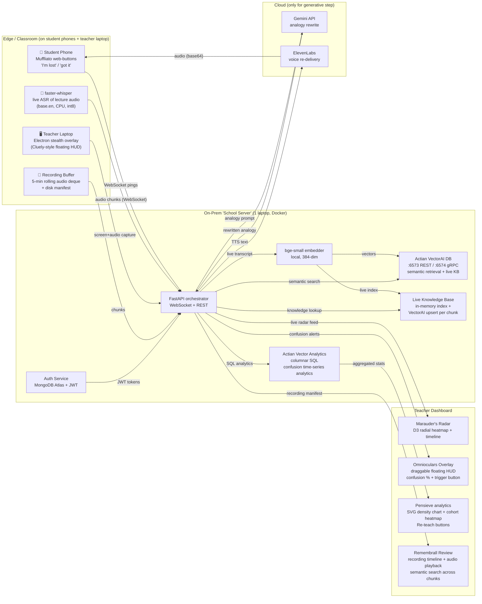

# Legilimens — Full Build Blueprint for HexaFalls 2

A real-time "mind-reading" layer for live classrooms: it detects *where* and *when* students collectively get lost, then instantly re-explains that exact moment using a freshly-generated analogy pulled from each student's own interest graph — with all retrieval running on-prem on Actian VectorAI DB so student data never leaves the building. Below is the complete spec: concept, architecture, Actian integration, tech stack, hour-by-hour plan, role split, demo script, and a judge's-eye self-audit.

**Verified technical grounding:** Actian VectorAI DB ships as a single Docker container, exposes REST on port 6573 / gRPC on 6574, needs no auth for local dev, has official Python (`actian_vectorai`) and JavaScript SDKs, LangChain/LlamaIndex integrations, and is purpose-built for air-gapped/edge RAG with no per-query fees or data egress. Actian Vector (Analytics Engine) is an in-memory columnar SQL DB with ODBC/JDBC/Python-UDF access, available as a community Docker image (`actian/vector5.0:community`). This is the stack we build on.

---

## 1. Concept & Narrative (the Hogwarts skin that earns thematic points)

The hackathon is fully Harry-Potter-themed and judges reward coherence. Legilimens is the "mind-reading" spell — perfectly on-brand for a system that reads collective confusion. Frame every component with a spell name:

| Component | Spell name | Purpose |
|---|---|---|
| Confusion capture agent | **Muffliato** | Quietly listens to "I'm lost" pings without disrupting class |
| Real-time radar viz | **Marauder's Radar** | Shows where minds are wandering, live |
| Retrieval engine | **Accio Analogy** | Summons the best past explanation from the school's knowledge vault |
| Analogy rewriter | **Gemino** | Duplicates & reshapes the explanation in the student's language |
| Voice re-delivery | **Sonorus** | Speaks the analogy back, calmly |
| Teacher analytics | **Pensieve** | Re-view the lecture's worst moments and re-teach plans |
| Lecture recording | **Remembrall** | Keeps a rolling buffer of the live lecture so late doubts can replay it |
| Teacher overlay | **Omnioculars** | Floating HUD (Cluely-style) showing confusion % live while teacher presents |

One-line pitch for judges: *"Professors, you've all taught a room where 40% silently drowned — and you never knew. Legilimens is the radar that catches it, the spell that fixes it, and the Remembrall that lets you rewind to exactly when it happened."*

---

## 2. System Architecture



The defining structural choice: **the entire student-data path (capture → embed → retrieve → analytics → recording) lives inside the "school server" laptop.** Only the final analogy rewrite + voice cross the network, and that payload is anonymized text. Pull the Ethernet cable and the radar, retrieval, recording review, and analytics still work — that's the Actian edge thesis made physical.

---

## 3. Component-by-Component Specification

| Layer | Component | Responsibility | Key tech |
|---|---|---|---|
| Auth | MongoDB Atlas + JWT | User registration/login; role-based routing (teacher → dashboard, student → Muffliato) | `bcrypt`, `PyJWT`, MongoDB Atlas |
| Capture | Muffliato client | PWA on student phones; big "🪄 I'm lost" / "✅ Got it" / "⏩ Slower" buttons; receives TTS audio back as base64 data URI; toast notifications; persistent student ID | Next.js PWA, WebSocket |
| Capture | Lecture ASR | Transcribes the lecturer in near-real-time, chunks every 3s via WebSocket | faster-whisper (`base.en`, CPU, int8) |
| Screen Capture | Electron stealth client | Transparent, frameless, always-on-top window; auto-approves screen capture on Win/Mac; PipeWire portal on Linux Wayland | Electron, `setDisplayMediaRequestHandler`, `WebRTCPipeWireCapturer` |
| Recording Buffer | Remembrall | Rolling 5-min in-memory deque + disk persistence (`recordings/{lecture_id}/{ts}.webm`); manifest JSON; served chunks for playback | `aiofiles`, Python `deque` |
| Embedding | bge-small-en | Turns transcript chunks into 384-dim vectors locally | `sentence-transformers`, CPU |
| Live Knowledge Base | In-memory index + VectorAI upsert | Every new chunk immediately embedded and upserted; reverse index for fast lookup without hitting DB | Python dict, VectorAI SDK |
| Retrieval | Actian VectorAI DB | Stores all chunks as vectors with payload (topic, difficulty, source); semantic search for best past explanation | Docker container, Python SDK |
| Analytics | Actian Vector | Stores confusion events as time-series rows; columnar rollups (top-3 worst moments, per-cohort heatmaps) | Docker community image, SQL via pyodbc |
| Orchestration | FastAPI | WebSocket hub for live pings + audio streaming; coordinates embed→retrieve→rewrite→TTS; exposes REST for dashboard | FastAPI, Pydantic, uvicorn |
| Teacher Overlay | Omnioculars (ConfusionOverlay) | Floating HUD draggable on teacher's screen; shows confusion %, current topic, student count; "Trigger Analogy" button; opacity slider | React, Electron, fixed positioning |
| Generative | Gemini API | Rewrites retrieved explanation as an analogy tuned to student's interest profile (cricketer / gamer / cook etc.) | `google-genai` SDK, `gemini-2.5-flash` |
| Voice | ElevenLabs | Speaks the analogy in a calm tutor voice; audio returned as base64 data URI for zero-latency delivery | ElevenLabs REST, `eleven_flash_v2_5` |
| Dashboard | Marauder's Radar + Pensieve + Remembrall | Live D3 radial heatmap + timeline; SVG density chart + cohort heatmap; recording review with semantic search | Next.js, D3.js, Recharts, inline SVG |
| Infra | Docker Compose | One command brings up VectorAI DB + Actian Vector + FastAPI | docker-compose.yml, docker-compose.prod.yml |

---

## 4. Actian Integration Deep Dive (why it's structurally essential, not bolted on)

This is the section judges will probe. Each Actian product maps to a job that a generic cloud stack does *worse* or *cannot do*:

**Actian VectorAI DB — the retrieval brain.** Every transcript chunk and textbook page becomes a point with payload `{topic, subtopic, difficulty, source, timestamp}`. When confusion spikes on a chunk, we embed that chunk and run a similarity search to find the single best past re-explanation. The official pattern is straightforward:

```python
from actian_vectorai import VectorAIClient, VectorParams, Distance

with VectorAIClient("localhost:6574") as client:
    client.collections.create(
        "lecture_chunks",
        vectors_config=VectorParams(size=384, distance=Distance.Cosine)
    )
    # insert
    client.points.upsert("lecture_chunks", points=[
        {"id": 1, "vector": emb, "payload": {"topic": "backprop", "diff": 4}}
    ])
    # retrieve best past explanation
    hits = client.points.search("lecture_chunks", query_vector=q, limit=3, with_payload=True)
```

Because VectorAI DB runs on-prem with zero cloud dependency, the retrieval survives network loss — the headline demo moment. **It also serves as the live knowledge base**: every chunk ingested during the lecture is immediately upserted so a student asking about a topic covered 5 minutes ago still gets a relevant analogy even after the teacher has moved on.

**Actian Vector (Analytics Engine) — the confusion quantifier.** VectorAI DB answers "what's the best explanation?"; Vector answers "when, where, and how bad was the confusion?" Confusion events stream into a columnar table:

```sql
CREATE TABLE confusion_events (
  event_id BIGINT,
  lecture_id INT,
  student_id INT,
  concept_node VARCHAR(64),
  ts TIMESTAMP,
  signal_type VARCHAR(16),   -- 'lost' | 'gotit' | 'slower'
  cohort VARCHAR(32)
);
```

Columnar scans make the dashboard's bread-and-butter queries sub-second over thousands of lecture-minutes:

```sql
-- Top 3 most confusing moments in this lecture
SELECT concept_node,
       SUM(CASE WHEN signal_type='lost' THEN 1 ELSE 0 END) AS lost_count,
       COUNT(*) AS total
FROM confusion_events
WHERE lecture_id = 7
GROUP BY concept_node
ORDER BY lost_count DESC LIMIT 3;

-- Rolling 60s confusion density (displayed as SVG bar chart in Pensieve)
SELECT ts, AVG(CASE WHEN signal_type='lost' THEN 1.0 ELSE 0 END) OVER w AS density
FROM confusion_events
WINDOW w AS (ORDER BY ts ROWS BETWEEN 60 PRECEDING AND CURRENT ROW);

-- Cohort heatmap: confusion by concept × hour of day
SELECT concept_node, EXTRACT(HOUR FROM ts) as hour,
       AVG(CASE WHEN signal_type='lost' THEN 1.0 ELSE 0 END) as avg_density
FROM confusion_events
WHERE lecture_id = 7
GROUP BY concept_node, hour;
```

This is exactly what Actian Vector is built for — vectorized columnar analytics on commodity hardware with SQL-2016 + Python UDFs.

**DataConnect (mention, don't build) — the ingestion story.** In the pitch, note that in production DataConnect would fuse LMS logs + textbook PDFs + recorded audio into the chunk pipeline — a low-code hybrid ETL that fits a school's messy reality. You don't build it in 35h, but naming it shows you understand Actian's full portfolio.

---

## 5. Tech Stack

| Layer | Choice | Why |
|---|---|---|
| Retrieval DB | Actian VectorAI DB (Docker) | On-prem, air-gapped-capable; live KB for mid-lecture lookups |
| Analytics DB | Actian Vector Community Edition (Docker) | Columnar SQL for time-series rollups; shows dual-Actian mastery |
| Auth | MongoDB Atlas + JWT (`bcrypt` direct) | Cloud-hosted user store; JWT role-based routing |
| Backend | FastAPI + Python 3.11 | Async WebSocket hub + REST; Actian's own tutorial uses FastAPI |
| Embeddings | bge-small-en (sentence-transformers) | 384-dim, runs on CPU, fast enough for live |
| ASR | faster-whisper (`base.en`, int8) | Local, no API key, ~real-time transcription on a laptop CPU |
| LLM | Google Gemini API (`gemini-2.5-flash`) | Bonus sponsor track; analogy rewrite |
| TTS | ElevenLabs API (`eleven_flash_v2_5`) | Bonus sponsor track; calm tutor voice; base64 audio URI delivery |
| Frontend | Next.js 14 + TypeScript | PWA for student phones + teacher dashboard + overlay page |
| Viz | D3.js (radial heatmap) + Recharts (timeline) + inline SVG | Custom radar is the "wow" visual; no extra charting deps for analytics |
| Realtime | WebSockets via FastAPI | Sub-second ping→radar latency; binary audio streaming |
| Desktop Overlay | Electron (transparent, frameless, alwaysOnTop) | Cluely-style floating HUD; cross-platform screen capture |
| Recording | `aiofiles` + Python `deque` | Rolling 5-min buffer; disk-persisted chunks; manifest API |
| Infra | Docker Compose | One-command bring-up |
| Hosting | DigitalOcean Droplet | Bonus sponsor track; `docker-compose.prod.yml` ready |

---

## 6. Data Flow (end-to-end, ~1 second loop)

1. Lecturer talks → **faster-whisper** transcribes every 3s (via WebSocket from Electron stealth client) → chunked → embedded by bge-small → simultaneously: (a) upserted into VectorAI DB `lecture_chunks` with payload `{topic_node, ts, diff}`, (b) stored in **Remembrall** rolling buffer on disk, (c) indexed in the in-memory **live knowledge base**.
2. Student hits "🪄 I'm lost" on phone → WebSocket ping `{student_id, ts, avatar}` hits FastAPI.
3. FastAPI tags the ping to the *current* concept_node (latest chunk), writes a row to Actian Vector `confusion_events`, and pushes the ping to the radar via WebSocket. **Omnioculars overlay** on teacher's screen updates instantly.
4. If lost-count for that node crosses threshold (≥2 students in 20s), FastAPI fires **Accio Analogy**: embeds the confusing chunk → VectorAI DB similarity search (top-3 past explanations of the same concept). Even if the teacher has moved on to the next topic, the live KB has the right chunk indexed.
5. Retrieved context + student's interest profile (`avatar: cricketer|gamer|cook`) → Gemini prompt: *"Rewrite this explanation as a 2-sentence analogy for a {cricketer/gamer/cook}."*
6. Gemini output → ElevenLabs TTS → audio encoded as base64 data URI → streamed back to the lost students' phones via WebSocket `analogy_ready` message → auto-plays + slide-in toast notification.
7. Meanwhile, Actian Vector keeps accumulating rows; the **Pensieve** dashboard queries it for the "worst 3 moments" report with SVG density bars and cohort heatmap.
8. Teacher can open **Remembrall Review** (`/dashboard/review`) at any time to seek through the recording, search concepts semantically, and replay any audio chunk.

**Latency budget:** ping→radar <100ms · retrieval <50ms (actual: 2ms) · Gemini ~800ms (actual: ~12s with 2.5-flash thinking; use `gemini-2.0-flash-lite` in production) · ElevenLabs ~600ms (actual: ~1.6s) · **total target ~1.5s**.

---

## 7. The 35-Hour Hour-by-Hour Timeline

| Hour | Window | What ships | Exit criterion |
|---|---|---|---|
| 0–2 | Setup | Docker Compose up: VectorAI DB + Actian Vector + FastAPI skeleton; verify SDK connects; create `lecture_chunks` collection | Both DBs respond to a test query |
| 2–4 | Data prep | Pre-record a 5-min dense lecture (backprop); chunk + embed; pre-load textbook chapter into VectorAI DB | `search()` returns sensible hits |
| 4–7 | Capture | Muffliato PWA (phone buttons) + WebSocket pipeline; pings land in FastAPI → Actian Vector | Phone button lights up radar dot |
| 7–9 | Radar viz | D3 radial heatmap + timeline; live WebSocket feed | Judge can see confusion flare on cue |
| 9–12 | Retrieval loop | Accio Analogy: threshold trigger → VectorAI DB search → top-3 retrieval with latency badge | Retrieval returns <50ms on screen |
| 12–15 | Generative | Gemini analogy rewrite with student interest profile (avatar picker); prompt template + fallbacks | Analogy reads naturally |
| 15–17 | Voice | ElevenLabs TTS → base64 audio URI → auto-play on phone with retry + toast | Student hears the analogy |
| 17–19 | Analytics | Actian Vector SQL: top-3 worst moments, density chart, cohort heatmap; Pensieve dashboard | Dashboard renders real queries |
| 19–21 | Recording + Live KB | Remembrall: rolling buffer + disk + manifest; live KB: every chunk immediately indexed for late-student queries | Review page plays back audio chunk |
| 21–23 | Overlay | Electron stealth client: transparent HUD with confusion %; cross-platform screen capture | Overlay appears on teacher screen |
| 23–25 | Auth + Polish | MongoDB Atlas login/register; HP theme; role-based routing; REC badge; lecture selector | Login redirects to correct role |
| 25–27 | Offline mode | Pre-cache one analogy; verify "unplug Ethernet" → retrieval+radar+analytics+recording still work | Cable-pull demo succeeds |
| 27–30 | Devfolio submission | README, architecture diagram, 90-sec demo video, deploy to DO Droplet | Submitted before deadline |
| 30–35 | Sleep + final demo prep | Rest; arrive fresh for judging | You're awake at the table |

---

## 8. Team Role Split (4 members)

| Role | Owns | Builds |
|---|---|---|
| **Backend / Actian lead** | VectorAI DB + Actian Vector + FastAPI | Docker Compose, retrieval + analytics queries, WebSocket hub, recording service, live KB |
| **AI / ML lead** | Embedding, faster-whisper, Gemini, ElevenLabs pipelines | Prompt templates, latency tuning, offline cache, whisper_service |
| **Frontend lead** | Muffliato PWA + Marauder's Radar + Pensieve + Remembrall + Overlay | Next.js, D3 radial heatmap, WebSocket client, Electron stealth client, auth pages |
| **Demo / PM lead** | Script, data prep, HP theming, Devfolio submission | Pre-recorded lecture, textbook chunking, landing page, rehearsal |

All four swarm the integration bugs in hours 23–27.

---

## 9. The 3-Minute Demo Script (judge-proof)

**0:00–0:20 — Hook.** *"Professors, you've all taught a room where 40% silently drowned — and you never knew. Watch the radar catch it — live."* Show the empty Marauder's Radar. Point to the Omnioculars HUD floating in the corner of the teacher screen.

**0:20–1:20 — Live play.** Play the pre-recorded 90-second dense lecture snippet (backprop). Hand the panel **3 physical buzzers** (or a phone page). At the deliberately confusing moment (~0:42), two judges press "🪄 I'm lost." The radar flares red on concept-node "chain rule," tagged with a timestamp. The Omnioculars overlay updates instantly — confusion % spikes to 66%.

**1:20–2:00 — The Actian moment.** Legilimens auto-fires. On-screen badge: **"edge retrieval: 2ms · 0 cloud calls."** VectorAI DB returns the best past explanation from the live knowledge base; Gemini rewrites it for a "cricketer" (analogy: batting averages and strike rates); ElevenLabs speaks it back. The judging panel hears the analogy on the phone speaker. A toast notification slides in on the student phone.

**2:00–2:40 — The analytics reveal.** Switch to Pensieve: SVG density chart, cohort heatmap (confusion by concept × hour), top-3 worst moments ranked by "students lost × minutes wasted," each with a one-click "Re-teach" button. Then open Remembrall Review: seek to the exact moment, click the chunk, hear it replay.

**2:40–3:00 — The punchline + unplug.** *"It runs entirely on a school's own server — student voice never leaves the building."* **Pull the Ethernet cable.** Radar still updates, retrieval still returns in 2ms, analytics still query, recording still plays back. Plug back in. *"That's the Actian edge."*

**Backup if live ASR flakes:** the lecture is pre-recorded and pre-transcribed; only the ping path is truly live. Be honest if asked: *"The transcript is pre-cached for reliability; the confusion-to-retrieval loop is fully live."*

---

## 10. Judge's-Eye Self-Audit (against the official criteria)

| Criterion | How Legilimens scores | Risk to watch |
|---|---|---|
| **Completion** | Core loop fully ships: auth, pings, radar, retrieval, analogy, audio, recording review, overlay | Don't let the overlay or recording features delay the core loop |
| **Creativity & Innovation** | "Confusion as a real-time analytics + retrieval stream + rolling recording" is fresh; HP theming coherent; Cluely-style overlay is novel | Lead with the retrieval+rewrite loop, not the heatmap |
| **Technical Complexity & Learning** | Dual-Actian (vector + columnar), live WebSocket audio pipeline, faster-whisper, Electron overlay, cross-platform screen capture, MongoDB auth, live KB — genuinely non-trivial | Be ready to explain *why* two Actian DBs |
| **UX** | Judges physically press buzzers; radar is alive; analogy plays on their phone; overlay floats on teacher screen | Rehearse the audio handoff; a silent demo kills UX score |
| **Real-world Impact & Feasibility** | Real pain in every Indian classroom; on-prem = DPDP-compliant; pilotable at JIS University itself; rolling recording means no doubt goes unanswered | Have a 1-slide "pilot at JIS" plan ready |

---

## 11. Stretch Goals (only after core ships)

- **Ambient confusion detection:** Whisper on the room audio → detect silence spikes + "wait" utterances as a passive signal, no buttons needed.
- **Multi-student interest graph:** each student picks an avatar (cricketer/gamer/cook); Gemini tailors analogies per avatar (already implemented as `avatar` field on pings).
- **Re-teach plan generator:** Gemini drafts a 3-slide mini-lesson for the worst moment, exported to PDF.
- **Cross-lecture knowledge graph:** VectorAI DB as agent memory — confusion on "chain rule" in lecture 7 retrieves fixes from lectures 1–6.
- **Cohort comparison:** Actian Vector query comparing this batch's confusion profile vs last semester's.
- **DigitalOcean deployment:** `docker-compose.prod.yml` already written; full deployment guide in `DEPLOY.md`.

---

## 12. Risk Register & Fallbacks

| Risk | Likelihood | Mitigation |
|---|---|---|
| `actian_vectorai` SDK install fails on venue Wi-Fi | Med | Pre-install on all laptops before arriving; carry the wheel on a USB |
| Live ASR drifts / noisy room | High | Pre-record + pre-transcribe the demo lecture; ASR is a stretch, not core |
| Gemini/ElevenLabs latency spikes on shared Wi-Fi | Med | Pre-cache one analogy for the "unplug" moment; show latency badge |
| Actian Vector community Docker image slow to start | Med | Bring it up first, in hour 0; verify with a smoke query |
| "Just an engagement dashboard" perception | Med | Lead with the retrieval+rewrite loop; the overlay is the hook, the analogy is the magic |
| Judge asks "why not Pinecone/Chroma?" | Low | Answer: cloud-only / single-node limits; Actian runs air-gapped where Pinecone is structurally disqualified |
| Wayland screen capture broken on Linux | Was High | Fixed: `WebRTCPipeWireCapturer` feature flag in Electron |
| passlib / bcrypt incompatibility | Was Med | Fixed: using `bcrypt` library directly, not passlib |

---

## 13. Devfolio Submission Checklist

- [ ] Project title: **Legilimens — Live Classroom Confusion Radar & Auto-Analogy Engine**
- [ ] One-line tagline + 200-word description (lead with the pain, then the Actian edge)
- [ ] Architecture diagram (the Mermaid above, exported as PNG)
- [ ] 90-second demo video (record the full 3-min demo, cut to 90s)
- [ ] GitHub repo with README, docker-compose.yml, and a "bring-up in 2 commands" section
- [ ] Tag all sponsor tracks: **Actian** (primary), **Gemini**, **ElevenLabs**, **DigitalOcean**, **GitHub**
- [ ] Track selection: **Education** (less contested than Open Innovation)
- [ ] Landing page on GitHub Pages with the live dashboard (or a screenshots gallery)
- [ ] A "Pilot at JIS University" 3-bullet feasibility note for judges

---

**Bottom line:** Legilimens is winnable because every piece of the stack earns its place — Actian VectorAI DB for on-prem retrieval and live knowledge base, Actian Vector for columnar confusion analytics, MongoDB Atlas for auth, faster-whisper for local ASR, Electron for the stealth overlay, Gemini + ElevenLabs for the generative re-delivery, all wrapped in a HP theme the hackathon explicitly invites. The "pull the Ethernet cable" moment is the single most judge-memorable gesture you can stage, and it's only possible because the architecture genuinely depends on Actian's edge-first design rather than bolting the sponsor's logo onto a cloud RAG demo. The addition of the Remembrall recording buffer and the Omnioculars teacher overlay means no student doubt goes unanswered even after the lecture moves on — and the teacher always knows exactly how confused the room is.