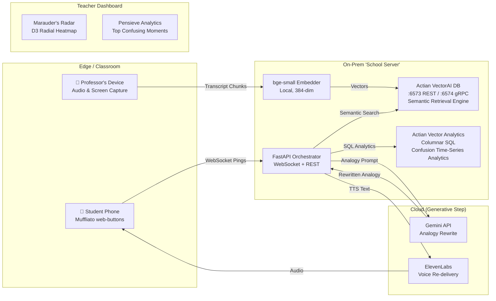

<div align="center">
  <picture>
    
  </picture>
</div>

<br><br>
<div align="center">
  <h3>⚡ A real-time "mind-reading" layer for live classrooms. ⚡</h3>
  <h3>It detects where and when students collectively get lost, then instantly re-explains that exact moment using a freshly-generated analogy pulled from each student's own interest graph — with all retrieval running natively on <b>Actian VectorAI DB</b> so student data never leaves the castle.</h3>
  <br>
  <blockquote>
    <h3><i>"Professors, you've all taught a room where 40% silently drowned — and you never knew. Legilimens is the radar that catches it, and the spell that fixes it, in under a second, on the school's own server."</i></h3>
  </blockquote>
</div>
<br><br>


<div align="center">
  
</div>

> 📜 **The Prophecy**
> 
> <h3>In the Grand Halls of learning, students often hesitate to interrupt a professor to say "I don't get it." As a result, professors power through material while a silent majority falls into the abyss.</h3>
> 
> <h3><b>Legilimens</b> acts as a silent, telepathic feedback loop between students and Headmasters. When multiple students indicate confusion via a simple web button, the system:</h3>
> 
> <h3>1️⃣ <b>Captures</b> the exact audio, video frames, and transcript of what the professor was teaching at that exact second.</h3>
> <h3>2️⃣ <b>Retrieves</b> past analogies or contextual chunks from the school's localized knowledge vault (powered entirely by <b>Actian VectorAI DB</b>).</h3>
> <h3>3️⃣ <b>Generates</b> a custom, deeply resonant analogy based on the student's personal interests (e.g., explaining pointers using Quidditch).</h3>
> <h3>4️⃣ <b>Delivers</b> this analogy back to the confused student instantly via text and voice, without interrupting the flow of the class.</h3>


<div align="center">
  
</div>

<h3>✨ We achieve this through a highly optimized architecture built heavily on top of the <b>Actian VectorAI Database</b>. ✨</h3>

<h3>🔮 <b>1. Continuous Capture:</b> The professor's lecture is recorded locally (Audio/Transcript and Screen Capture).</h3>  
<h3>🔮 <b>2. Actian VectorAI Data Vault:</b> All lecture context (transcripts, OCR text, slides) is embedded locally using a <code>bge-small</code> embedding model and stored natively in the <b>Actian VectorAI DB</b> (which provides lightning-fast semantic retrieval and gRPC endpoints).</h3>  
<h3>🔮 <b>3. Confusion Pings:</b> Students tap a "Muffliato" button on their phones when lost.</h3>  
<h3>🔮 <b>4. Actian Contextual RAG Pipeline:</b> When a ping is received, our FastAPI orchestrator instantly queries the <b>Actian VectorAI DB</b> to grab the exact lecture context of that exact moment using high-dimensional vector search.</h3>  
<h3>🔮 <b>5. Generative Personalization:</b> The Actian-retrieved context is sent to the <b>Gemini API</b> to generate a bespoke analogy.</h3>  
<h3>🔮 <b>6. Voice Synthesis:</b> The personalized analogy is synthesized into natural speech via <b>ElevenLabs</b> and played quietly to the student.</h3>  
<h3>🔮 <b>7. Teacher Analytics:</b> Post-lecture, the professor uses the <b>Pensieve Dashboard</b>, running deeply integrated <b>Actian Vector Analytics (columnar SQL)</b>, to review the time-series data of the most confusing moments of the lecture.</h3>


<div align="center">
  
</div>

<div align="center">
  <h3><i>Built for a Harry-Potter-themed hackathon, every component carries a spell name reflecting its magical role:</i></h3>
</div>
<br>

| 🪄 Spell | 🧩 Component | ⚙️ Technical Implementation | 🎯 Purpose |
|:---|:---|:---|:---|
| **Muffliato** | Confusion Capture | Next.js 14 PWA, WebSockets | Quietly listens to "I'm lost" pings from student phones without disrupting class. |
| **Marauder's Radar** | Real-time Viz | D3.js Radial Heatmap + React | Shows professors where minds are wandering, live. |
| **Accio Analogy** | Retrieval Engine | **Actian VectorAI DB**, `bge-small` | Summons the best past explanation from the school's highly secure knowledge vault. |
| **Gemino** | Analogy Rewriter | Gemini API | Reshapes the explanation using the student's interest graph. |
| **Sonorus** | Voice Re-delivery | ElevenLabs TTS | Speaks the analogy back calmly and clearly. |
| **Pensieve** | Teacher Analytics | **Actian Vector (Columnar SQL)** | Re-view the lecture's worst moments and re-teach plans. |


<div align="center">
  
  
</div>

<details>
<summary><b>📜 Click here to view the Architecture Diagram in ASCII format</b></summary>
<br>

```text
+-------------------------------------------------------------------+
|                       1. EDGE / CLASSROOM                         |
|                                                                   |
|       [📱 Student Phone]              [🎤 Professor's Device]     |
|    (Muffliato web-buttons)            (Audio & Screen Capture)    |
|               ^       |                           |               |
+---------------|-------|---------------------------|---------------+
         (Audio)|       |(WebSocket Pings)          |(Transcript)
                |       v                           v
+---------------|---------------------------------------------------+
|               |       2. ON-PREM 'SCHOOL SERVER'                  |
|               |                                                   |
|               |    [FastAPI Orchestrator]      [bge-small Embedder]
|               |      (WebSocket + REST)          (Local, 384-dim) |
|               |         |           |                     |       |
|               |         |           +-----------------+   |       |
|               |  (SQL)  v            (Semantic Search)v   v(Vectors)
|               | [Actian Analytics]       [Actian VectorAI DB]     |
|               |   (Columnar SQL)       (Semantic Retrieval Engine)|
+---------------|---------|---^-------------------------------------+
                |         |   |
     (TTS Text) | (Prompt)|   |(Rewritten Analogy)
                |         v   |
+---------------|---------------------------------------------------+
|               |        3. CLOUD (Generative Step)                 |
|               |                                                   |
|               |            [Google Gemini API]                    |
|               |             (Analogy Rewrite)                     |
|               |                                                   |
|               +----------- [ElevenLabs TTS]                       |
|                          (Voice Re-delivery)                      |
+-------------------------------------------------------------------+

+-------------------------------------------------------------------+
|                       4. TEACHER DASHBOARD                        |
|                                                                   |
|        [Marauder's Radar]              [Pensieve Analytics]       |
|       (D3 Radial Heatmap)            (Top Confusing Moments)      |
+-------------------------------------------------------------------+
```
</details>

<details>
<summary><b>📜 Click here to view the Architecture Diagram in Mermaid format</b></summary>
<br>


</details>


<div align="center">
  
</div>

> <h3>🧪 Follow these steps to brew the complete Legilimens stack locally.</h3>

### 1️⃣ Requirements (The Ingredients)
- **Docker** and **Docker Compose**
- **Node.js** (v18+) and **npm**
- **Python 3.10+**

### 2️⃣ Environment Variables & API Keys
Before casting your first spell, you must configure your API keys.

1. Navigate to the `backend` directory.
2. Copy the `.env.example` file to `.env`:
   ```bash
   cd backend
   cp .env.example .env
   ```
3. Open `.env` and fill in the required keys.

#### 🗝️ Required API Keys:
| Service | Purpose | How to Get It |
|:---|:---|:---|
| **Gemini API Key** | Primary Analogy Engine | Get a free key from [Google AI Studio](https://aistudio.google.com/). |
| **ElevenLabs API Key** | Voice Synthesis (TTS) | Create an account at [ElevenLabs](https://elevenlabs.io/) and generate an API key in your profile settings. |
| **MongoDB URI** | User Auth / Profiles | Create a free cluster on [MongoDB Atlas](https://www.mongodb.com/atlas). |

### 3️⃣ Summon the Actian VectorAI Database
We use Docker to spin up the Actian DB locally. Ensure Docker is running.
```bash
# Accept the EULA and run Actian VectorAI DB on ports 6573-6575
docker run -d --name vectorai -p 6573-6575:6573-6575 -e ACTIAN_VECTORAI_ACCEPT_EULA=YES actian/vectorai:latest
```

### 4️⃣ Ignite the FastAPI Backend
Open a new terminal window:
```bash
cd backend
python3 -m venv .venv
source .venv/bin/activate
pip install -r requirements.txt
uvicorn main:app --reload --host 0.0.0.0 --port 8000
```
> <h3>🦉 *The API will be available at `http://localhost:8000`. You can view the spellbook at `http://localhost:8000/docs`.*</h3>

### 5️⃣ Launch the Next.js Frontend
Open a new terminal window:
```bash
cd frontend
npm install
npm run dev
```
> <h3>🦉 *The magical web interface will be available at `http://localhost:3000`.*</h3>


<div align="center">
  
</div>

<h3>This project was proudly built targeting the Education track, leveraging:</h3>
<h3>- <b>Actian</b> (Primary DB + Vector Search)</h3>
<h3>- <b>Gemini</b> (Primary LLM Engine)</h3>
<h3>- <b>ElevenLabs</b> (Voice TTS)</h3>
<h3>- <b>MongoDB</b> (User Graph)</h3>
<h3>- <b>GitHub</b> (Version Control)</h3>

<div align="center">
  
</div>

> <h3>⚖️ MIT License — Copyright (c) 2026 <b>Sourodyuti Biswas Sanyal & Akshar Nath Gorain</b>. See <a href="./LICENSE">LICENSE</a>.</h3>
