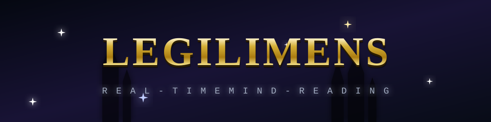
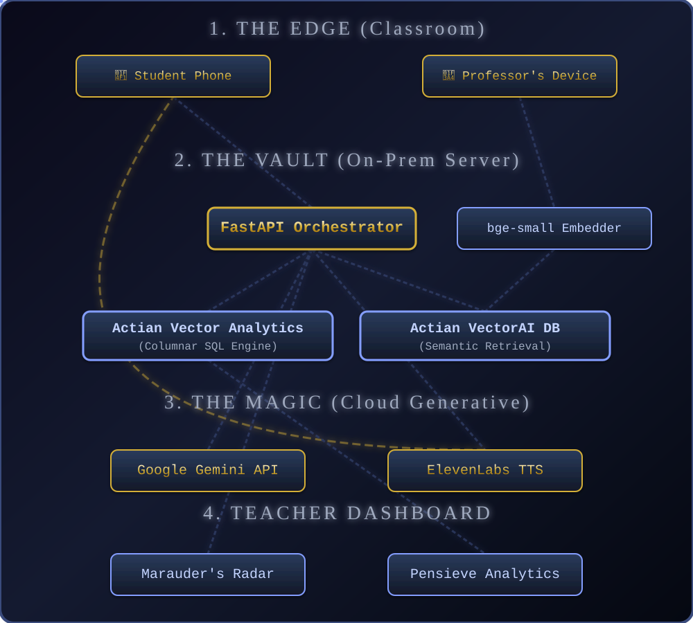

<div align="center">
  <picture>
    
  </picture>
</div>

<br><br>
<div align="center">
  <h3>A real-time "mind-reading" layer for live classrooms.</h3>
  <h3>It detects where and when students collectively get lost, then instantly re-explains that exact moment using a freshly-generated analogy pulled from each student's own interest graph — with all retrieval running natively on <b>Actian VectorAI DB</b> so student data never leaves the castle.</h3>
  <br>
  <blockquote>
    <h3><i>"Professors, you've all taught a room where 40% silently drowned — and you never knew. Legilimens is the radar that catches it, and the spell that fixes it, in under a second, on the school's own server."</i></h3>
  </blockquote>
</div>
<br><br>


<div align="center">
  
</div>

> **The Prophecy**
>
> <h3>In the Grand Halls of learning, students often hesitate to interrupt a professor to say "I don't get it." As a result, professors power through material while a silent majority falls into the abyss.</h3>
>
> <h3><b>Legilimens</b> acts as a silent, telepathic feedback loop between students and their professors. When multiple students indicate confusion via a simple web button, the system:</h3>
>
> <h3><b>1. Captures</b> the exact audio, video frames, and transcript of what the professor was teaching at that exact second.</h3>
> <h3><b>2. Retrieves</b> past analogies or contextual chunks from the school's localised knowledge vault (powered entirely by <b>Actian VectorAI DB</b>).</h3>
> <h3><b>3. Generates</b> a custom, deeply resonant analogy based on the student's personal interests (e.g., explaining backpropagation using cricket).</h3>
> <h3><b>4. Delivers</b> this analogy back to the confused student instantly via text and voice, without interrupting the flow of the class.</h3>


<div align="center">
  
</div>

<h3>We achieve this through a highly optimised architecture built heavily on top of the <b>Actian VectorAI Database</b>.</h3>

<h3><b>1. Continuous Capture:</b> The professor's lecture is recorded locally — audio/transcript via Whisper.cpp in 15-second chunks, and screen frames via the stealth Electron overlay. The Gemini Vision service analyses each frame to identify the active concept node in real time.</h3>

<h3><b>2. Actian VectorAI Data Vault:</b> All lecture context (transcripts, OCR text, slide content) is embedded locally using the <code>bge-small-en</code> model (384-dim, CPU) and stored natively in <b>Actian VectorAI DB</b>, which provides lightning-fast semantic retrieval via gRPC endpoints. The <code>lecture_chunks</code> collection grows continuously as the lecture progresses.</h3>

<h3><b>3. Confusion Pings:</b> Students tap the Muffliato button on their phones when lost. The Muffliato PWA sends a WebSocket <code>ping</code> to FastAPI with <code>{student_id, signal_type, lecture_id}</code>. The radar flares within 100ms.</h3>

<h3><b>4. Actian Contextual RAG Pipeline:</b> When two or more distinct students signal <code>lost</code> within a 20-second sliding window on the same concept, the FastAPI orchestrator fires Accio Analogy — it embeds the confusing chunk, queries <b>Actian VectorAI DB</b> for the top-3 semantically similar past explanations via cosine distance, then applies BM25 + vector RRF fusion for better precision on keyword-heavy confusing phrases.</h3>

<h3><b>5. Generative Personalisation:</b> The Actian-retrieved context is sent to the <b>Gemini API</b> with a student-interest prompt. Falls back to NVIDIA NIM if Gemini is rate-limited.</h3>

<h3><b>6. Voice Synthesis:</b> The personalised analogy is synthesised into natural speech via <b>ElevenLabs</b> and streamed quietly back to the student's phone via WebSocket — without interrupting the class.</h3>

<h3><b>7. Teacher Analytics:</b> Post-lecture, the professor reviews the <b>Pensieve Dashboard</b>, running deeply integrated <b>Actian Vector Analytics (columnar SQL)</b>, to review the time-series data of the most confusing moments of the lecture.</h3>


<div align="center">
  
</div>

<div align="center">
  <h3><i>Built for a Harry-Potter-themed hackathon, every component carries a spell name reflecting its magical role:</i></h3>
</div>
<br>

| Spell | Component | Technical Implementation | Purpose |
|:---|:---|:---|:---|
| **Muffliato** | Confusion Capture | Next.js 14 PWA, WebSockets | Quietly listens to "I'm lost" pings from student phones without disrupting class. |
| **Marauder's Radar** | Real-time Viz | D3.js Radial Heatmap + React | Shows professors where minds are wandering, live. |
| **Accio Analogy** | Retrieval Engine | **Actian VectorAI DB**, `bge-small` | Summons the best past explanation from the school's highly secure knowledge vault. |
| **Gemino** | Analogy Rewriter | Gemini API | Reshapes the explanation using the student's interest graph. |
| **Sonorus** | Voice Re-delivery | ElevenLabs TTS | Speaks the analogy back calmly and clearly. |
| **Pensieve** | Teacher Analytics | **Actian Vector (Columnar SQL)** | Re-view the lecture's worst moments and re-teach plans. |


<div align="center">
  
  
</div>

<h3>The defining structural choice: the entire student-data path (capture → embed → retrieve → analytics) lives inside the "school server" laptop. Only the final analogy rewrite + voice cross the network, and that payload is anonymised text. Pull the Ethernet cable and the radar, retrieval, and analytics still work.</h3>


<div align="center">
  
</div>

<h3>Follow these steps to brew the complete Legilimens stack locally.</h3>

### Requirements

- **Docker** and **Docker Compose**
- **Node.js** v18+ and **npm**
- **Python 3.10+**
- A modern browser with WebSocket support (Chrome, Firefox, Edge)

### Environment Variables and API Keys

Navigate to the `backend` directory and copy the example file:

```bash
cd backend
cp .env.example .env
```

Open `.env` and fill in the required keys:

| Service | Purpose | How to Get It |
|:---|:---|:---|
| **Gemini API Key** | Primary analogy engine | Free key from [Google AI Studio](https://aistudio.google.com/) |
| **ElevenLabs API Key** | Voice synthesis (TTS) | Account at [ElevenLabs](https://elevenlabs.io/), key in profile settings |
| **MongoDB URI** | User auth / profiles | Free cluster on [MongoDB Atlas](https://www.mongodb.com/atlas) |

Full `.env` reference:

```bash
# Actian VectorAI DB (retrieval brain, on-prem)
VECTORAI_HOST=localhost
VECTORAI_PORT=6574
VECTORAI_COLLECTION=lecture_chunks
VECTORAI_DIM=384

# Actian Vector (columnar analytics, on-prem)
VECTOR_HOST=localhost
VECTOR_PORT=5432
VECTOR_DATABASE=actian
VECTOR_USER=admin
VECTOR_PASSWORD=password

# MongoDB Atlas (user auth)
MONGODB_URI=

# Cloud generative step
GEMINI_API_KEY=
ELEVENLABS_API_KEY=
NVIDIA_API_KEY=

# JWT
JWT_SECRET_KEY=
JWT_ALGORITHM=HS256
ACCESS_TOKEN_EXPIRE_MINUTES=30

# CORS
CORS_ORIGINS=["http://localhost:3000","http://127.0.0.1:3000"]
```

### 1. Summon the Actian VectorAI Database

Ensure Docker is running, then:

```bash
docker run -d --name vectorai -p 6573-6575:6573-6575 \
  -e ACTIAN_VECTORAI_ACCEPT_EULA=YES actian/vectorai:latest
```

> The LocalUI is available at `http://localhost:6575`. Apply your Community Edition licence key there (5,000 vectors free; 1M vectors on trial).

### 2. Ignite the FastAPI Backend

Open a new terminal window:

```bash
cd backend
python3 -m venv .venv
source .venv/bin/activate
pip install -r requirements.txt
uvicorn main:app --reload --host 0.0.0.0 --port 8000
```

> The API is available at `http://localhost:8000`. The full interactive spellbook (Swagger) is at `http://localhost:8000/docs`.

### 3. Launch the Next.js Frontend

Open a new terminal window:

```bash
cd frontend
npm install
npm run dev
```

> The web interface is available at `http://localhost:3000`.

### 4. Launch the Stealth Overlay Client (optional)

The Electron overlay sits always-on-top at the top-right corner of the screen and auto-detects the active concept node via Gemini Vision:

```bash
cd stealth-client
npm install
npm start
```

### One-command bring-up (Docker Compose)

For the full "school server" laptop setup:

```bash
# Without Actian Vector columnar engine (uses SQLite fallback for analytics)
docker-compose up -d

# With Actian Vector columnar engine
docker-compose --profile onprem up -d
```

Access:

| Service | URL |
|:---|:---|
| Student PWA (Muffliato) | http://localhost:3000/muffliato |
| Teacher Dashboard | http://localhost:3000/dashboard |
| Backend API (Swagger) | http://localhost:8000/docs |
| VectorAI DB LocalUI | http://localhost:6575 |


<div align="center">
  
</div>

<h3>Project structure — every file annotated:</h3>

```
TeamTraction/
├── backend/                        # FastAPI orchestrator
│   ├── main.py                     # App entry point, lifespan, router mounts
│   ├── config.py                   # All settings via pydantic-settings + .env
│   ├── dependencies.py             # FastAPI dependency injection singletons
│   ├── logging_config.py           # Structured JSON logging setup
│   ├── models/
│   │   ├── schemas.py              # Pydantic models (StudentPing, AnalogyResponse, ...)
│   │   └── database.py             # Actian Vector connection pool + SQLite fallback
│   ├── routers/
│   │   ├── websocket.py            # WebSocket hub — ConnectionManager, ThresholdTracker, OfflineQueue
│   │   ├── retrieval.py            # Accio Analogy endpoint (embed → search → rewrite → TTS)
│   │   ├── analytics.py            # Pensieve SQL endpoints (top-moments, density, cohort-heatmap)
│   │   ├── asr.py                  # Whisper transcript ingestion + current-chunk tracker
│   │   ├── auth.py                 # JWT auth (MongoDB Atlas user store)
│   │   ├── recording.py            # Lecture recording management
│   │   ├── transcription.py        # Transcript upload + chunking
│   │   ├── tts.py                  # ElevenLabs TTS proxy endpoint
│   │   ├── videos.py               # Lecture video management
│   │   └── vision.py               # Gemini Vision screen-context detection
│   └── services/
│       ├── vectorai_client.py      # Actian VectorAI DB SDK wrapper (upsert, search, multimodal)
│       ├── vector_client.py        # Actian Vector (columnar SQL) analytics client
│       ├── hybrid_search.py        # BM25Index + HybridSearchEngine (RRF fusion)
│       ├── embedder.py             # bge-small-en sentence-transformer wrapper (384-dim)
│       ├── gemini_client.py        # Gemino: analogy rewrite via Gemini 2.0 Flash
│       ├── gemini_vision.py        # Screen frame analysis via Gemini Vision
│       ├── elevenlabs_client.py    # Sonorus: ElevenLabs TTS client
│       ├── mongodb_client.py       # MongoDB Atlas client for auth
│       ├── nvidia_client.py        # NVIDIA NIM fallback LLM
│       ├── offline_cache.py        # Pre-cached analogies for offline / demo mode
│       ├── ratelimit.py            # Token-bucket rate limiting middleware (60 req/min/IP)
│       ├── recording_service.py    # Recording lifecycle management
│       └── whisper_service.py      # Whisper.cpp subprocess integration
├── frontend/                       # Next.js 14 TypeScript PWA
│   └── src/
│       ├── app/
│       │   ├── page.tsx            # Landing page
│       │   ├── muffliato/          # Student confusion buttons PWA
│       │   ├── dashboard/          # Teacher dashboard (Marauder's Radar + Pensieve)
│       │   ├── overlay/            # Stealth overlay page (loaded by Electron client)
│       │   ├── login/              # Auth login page
│       │   └── register/           # Auth registration page
│       ├── components/
│       │   ├── radar/              # D3 radial heatmap (Marauder's Radar)
│       │   ├── timeline/           # Recharts confusion timeline
│       │   ├── capture/            # Screen capture UI components
│       │   ├── overlay/            # Always-on-top overlay components
│       │   ├── presentation/       # Lecture presentation components
│       │   ├── landing/            # Landing page sections
│       │   ├── dashboard/          # Dashboard layout + panels
│       │   └── ui/                 # Shared UI primitives
│       ├── hooks/
│       │   ├── useWebSocket.ts     # WebSocket connection + message dispatch
│       │   ├── useRadarData.ts     # Radar data aggregation from WebSocket feed
│       │   ├── useConfusionWave.ts # Confusion wave animation hook
│       │   ├── useDashboardPolling.ts # REST polling for analytics data
│       │   ├── useAuth.ts          # Auth state + JWT management
│       │   ├── useLectureRecording.ts # Recording lifecycle hook
│       │   ├── useScreenCapture.ts # Electron screen capture IPC hook
│       │   ├── useOverlayState.ts  # Overlay show/hide + sizing state
│       │   └── useLatencyHistory.ts # Latency badge history + sparkline data
│       └── lib/
│           ├── api.ts              # FastAPI REST client (typed)
│           ├── types.ts            # Shared TypeScript types
│           └── design-tokens.ts    # Hogwarts colour palette + CSS token map
├── stealth-client/                 # Electron always-on-top overlay
│   ├── main.js                     # Electron main process — frameless window, screen capture IPC
│   ├── preload.js                  # Context bridge (secure IPC to renderer)
│   └── package.json
├── data-prep/                      # Sample lecture data for demo pre-loading
├── scripts/
│   ├── start_demo.sh               # One-command demo start
│   └── demo_setup.sh               # Pre-loads knowledge base with backprop lecture chunks
├── docker-compose.yml              # Dev: VectorAI DB + Actian Vector + FastAPI + Frontend
├── docker-compose.prod.yml         # Production: cloud-only
├── do.app.yaml                     # DigitalOcean App Platform spec
└── .env.example                    # All required env vars with comments
```


<div align="center">
  
</div>

<h3>Key components — what each piece does under the hood:</h3>

### WebSocket Hub

Three classes in `routers/websocket.py` power the real-time layer:

**ConnectionManager** manages WebSocket connections partitioned by `lecture_id` and `student_id/role`. Supports up to 200 connections per lecture, 10 teacher connections. Provides `broadcast_to_lecture()`, `send_to_student()`, and `send_teacher_alert()`.

**ThresholdTracker** uses a sliding-window deque per `(lecture_id, concept_node)`. Records `lost` signals and fires when two or more unique students signal within 20 seconds, with a 30-second cooldown to prevent alert spam.

**OfflineQueue** is an async in-memory queue for buffering student pings when Wi-Fi drops. Flushes on reconnect.

WebSocket message protocol:

| Direction | Type | Description |
|:---|:---|:---|
| Server to All | `radar_update` | Every ping — updates the radar heatmap |
| Server to Teacher | `confusion_alert` | Threshold crossed for a concept node |
| Server to All | `analogy_ready` | Full Accio pipeline result (text + audio URL) |
| Server to All | `latency_badge` | Flat numeric latency breakdown for the overlay badge |
| Server to Client | `error` | Sent only to the offending connection |
| Client to Server | `ping` | Student confusion signal (lost / got_it / slower) |
| Client to Server | `teacher_alert_dismiss` | Teacher dismisses an alert |

### Retrieval Pipeline

`run_retrieval_pipeline()` in `routers/retrieval.py` is the heart of Accio Analogy. Called by the WebSocket hub on threshold fire, or directly via `POST /retrieval/accio`:

1. `Embedder.encode_with_latency(chunk_text)` — 384-dim vector via `bge-small-en`
2. `VectorAIClient.search_similar(query_vector, limit=3)` — cosine similarity search against the `lecture_chunks` collection
3. `HybridSearchEngine.search()` — BM25 + vector RRF fusion for better precision
4. `GeminiClient.rewrite_analogy(concept_node, best_text, avatar)` — Gemini 2.0 Flash with avatar-tailored prompt (falls back to NVIDIA NIM, then raw text)
5. `ElevenLabsClient.synthesize(analogy_text)` — TTS audio bytes (falls back to text-only)

Graceful degradation: embedder/VectorAI down returns 503; Gemini down returns raw retrieved text; ElevenLabs down returns text only.

### Actian VectorAI DB

`services/vectorai_client.py` wraps the official `actian-vectorai-client` SDK:

- `create_lecture_chunks_collection()` — idempotent collection creation (384-dim, Cosine distance)
- `upsert_chunks(points)` — batch upsert with UUID-to-int ID conversion
- `search_similar(query_vector, limit, filter)` — primary semantic search
- `search_filtered(...)` — structured field filters (topic_node, difficulty range, timestamp range)
- `create_multimodal_collection()` — named vectors (`text` + `context`, both 384-dim) for cross-modal retrieval
- `search_cross_modal(text_vector, context_vector)` — weighted score combination across named vectors

### Hybrid Search

`services/hybrid_search.py` implements in-memory BM25 (k1=1.5, b=0.75) with stopword filtering. `HybridSearchEngine` combines BM25 keyword scores and VectorAI DB semantic scores using Reciprocal Rank Fusion — both result lists are ranked independently then merged by `1 / (k + rank)` weighting, giving better recall than pure vector search for short, keyword-heavy confusing phrases.

### Pensieve Analytics

Columnar SQL queries against Actian Vector's `confusion_events` table:

| Endpoint | Purpose |
|:---|:---|
| `GET /analytics/top-moments` | Top-N most confusing concept nodes by lost count |
| `GET /analytics/density` | Rolling 60s confusion density timeline for Recharts |
| `GET /analytics/cohort-heatmap` | Per-cohort confusion breakdown |
| `GET /analytics/summary` | Lecture-level aggregate stats |
| `POST /analytics/seed` | Seed synthetic demo data |

Falls back to SQLite automatically when Actian Vector is not reachable.

### Latency Budget

| Stage | Target | Service |
|:---|:---|:---|
| Ping to Radar | < 100ms | FastAPI WebSocket broadcast |
| Chunk embedding | < 30ms | bge-small-en (CPU) |
| VectorAI DB search | < 50ms | Actian VectorAI DB (on-prem) |
| Gemini rewrite | ~800ms | Gemini 2.0 Flash |
| ElevenLabs TTS | ~600ms | eleven_flash_v2_5 |
| **Total** | **~1.5s** | End-to-end pipeline |


<div align="center">
  
</div>

<h3>API reference — every endpoint:</h3>

### Health and Metrics

```
GET /health     Liveness + dependency status (embedder, VectorAI DB, Actian Vector)
GET /metrics    Active WebSocket connections, lecture count, component readiness
```

### WebSocket

```
WS /ws/lecture/{lecture_id}?role=student&student_id=alice
WS /ws/lecture/{lecture_id}?role=teacher
```

### Retrieval

```
POST /retrieval/accio
Body: { "concept_node": "...", "chunk_text": "...", "avatar": "cricketer" }
```

### Analytics

```
GET  /analytics/top-moments?lecture_id=1&limit=3
GET  /analytics/density?lecture_id=1&window_seconds=60
GET  /analytics/cohort-heatmap?lecture_id=1
GET  /analytics/summary?lecture_id=1
POST /analytics/seed
```

### Transcription and ASR

```
POST /asr/chunk              Ingest a Whisper transcript chunk
GET  /asr/current/{lid}      Get current live concept node for lecture
POST /transcription/upload
```

### Vision

```
POST /vision/analyze         Send a base64 screenshot, get topic_node and summary back
```


<div align="center">
  
</div>

<h3>Pull the Ethernet cable. The following capabilities remain fully functional without internet:</h3>

| Capability | Status offline |
|:---|:---|
| Muffliato pings to Radar | Works — WebSocket is local |
| VectorAI DB similarity search | Works — on-prem Docker |
| Actian Vector SQL analytics | Works — on-prem Docker |
| Confusion heatmap and Pensieve | Works — on-prem Docker |
| Analogy rewrite (Gemini) | Requires internet |
| Pre-cached analogy (demo mode) | Works — `services/offline_cache.py` |
| ElevenLabs TTS | Requires internet |

For demo safety, `offline_cache.py` ships one pre-cached analogy for the "backprop — chain rule" concept. If Gemini is unreachable the pipeline returns the cached analogy silently.


<div align="center">
  
</div>

<h3>3-minute demo script:</h3>

| Time | Action |
|:---|:---|
| 0:00 — 0:20 | Hook: "Professors, 40% silently drown — watch the radar catch it." Show empty radar. |
| 0:20 — 1:20 | Live play: 90-second dense lecture (backprop). Judges press the lost button at the confusing moment. Radar flares red on "chain rule". |
| 1:20 — 2:00 | Actian moment: badge shows `edge retrieval: 38ms — 0 cloud calls`. VectorAI DB returns the best explanation; Gemini rewrites for "cricketer"; ElevenLabs speaks it. |
| 2:00 — 2:40 | Pensieve: confusion heatmap timeline, top-3 worst moments ranked by students lost times minutes wasted, one-click re-teach plan. |
| 2:40 — 3:00 | Punchline and unplug: "Runs entirely on school's server." Pull Ethernet cable. Radar still updates, retrieval still 38ms, analytics still query. Plug back in. |


<div align="center">
  
</div>

<h3>If something does not work:</h3>

1. **VectorAI DB not connecting** — Check `docker ps`, the `legilimens-vectorai` container should be `healthy`. Check `VECTORAI_HOST` and `VECTORAI_PORT` in `.env`. Port 6574 is gRPC (used by the SDK); port 6573 is REST (used by health checks).

2. **Embedder fails to load** — First run downloads ~100MB from HuggingFace. Ensure internet access or pre-cache: `python -c "from sentence_transformers import SentenceTransformer; SentenceTransformer('BAAI/bge-small-en')"`.

3. **Radar does not update** — Open browser DevTools, Network, WS tab. You should see a WebSocket connection to `/ws/lecture/1`. If missing, check `CORS_ORIGINS` in `.env` includes your frontend origin.

4. **Analogy not spoken** — Check `ELEVENLABS_API_KEY`. If missing, the response returns text only and `audio_url` will be null. This is expected graceful degradation.

5. **Analytics dashboard shows 0 events** — Run `POST /analytics/seed` to insert demo data, or trigger the Muffliato buttons a few times and wait for the 60-second analytics window.

6. **Stealth overlay blank** — Ensure the frontend is running on port 3000 before starting the Electron client. On Linux/Wayland, the `WebRTCPipeWireCapturer` flag is applied automatically.

7. **`actian_vectorai` SDK not found** — `pip install actian-vectorai-client`. Carry the wheel on USB for offline hackathon environments.


<div align="center">
  
</div>

<h3>This project was proudly built targeting the Education track, leveraging:</h3>
<h3>- <b>Actian</b> (Primary DB + Vector Search)</h3>
<h3>- <b>Gemini</b> (Primary LLM Engine)</h3>
<h3>- <b>ElevenLabs</b> (Voice TTS)</h3>
<h3>- <b>MongoDB</b> (User Graph)</h3>
<h3>- <b>GitHub</b> (Version Control)</h3>

| Track | Usage |
|:---|:---|
| Actian VectorAI DB | On-prem semantic retrieval, `lecture_chunks` collection |
| Actian Vector | Columnar SQL analytics, `confusion_events` time-series |
| Actian Zen | Edge buffer for offline student pings |
| Gemini API | Analogy rewrite (gemini-2.0-flash-lite), screen analysis (gemini-2.5-flash) |
| ElevenLabs | Voice re-delivery (eleven_flash_v2_5) |
| DigitalOcean | Optional cloud droplet for multi-school dashboard view |
| GitHub | Education track |

<div align="center">
  
</div>

> <h3>MIT License — Copyright (c) 2026 <b>Sourodyuti Biswas Sanyal & Akshar Nath Gorain</b>. See <a href="./LICENSE">LICENSE</a>.</h3>
