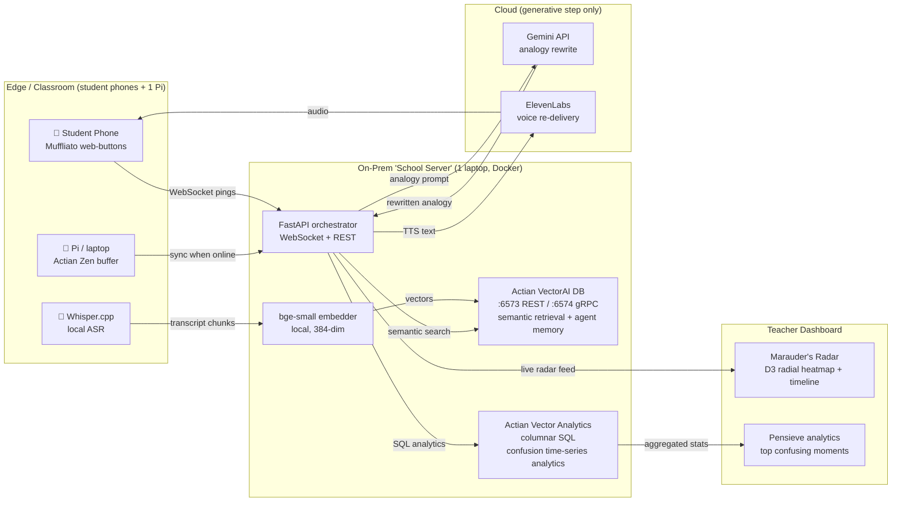

# Legilimens 🔮

> A real-time "mind-reading" layer for live classrooms. It detects *where* and *when* students collectively get lost, then instantly re-explains that exact moment using a freshly-generated analogy pulled from each student's own interest graph — with all retrieval running **on-prem on Actian VectorAI DB** so student data never leaves the building.

*"Professors, you've all taught a room where 40% silently drowned — and you never knew. **Legilimens** is the radar that catches it, and the spell that fixes it, in under a second, on the school's own server."*

Built for a Harry-Potter-themed hackathon. Every component carries a spell name:

| Spell | Component | What it does |
|---|---|---|
| **Muffliato** | Confusion capture | Quietly listens to "I'm lost" pings without disrupting class |
| **Marauder's Radar** | Real-time viz | Shows where minds are wandering, live (D3 radial heatmap) |
| **Accio Analogy** | Retrieval engine | Summons the best past explanation from the school's knowledge vault (Actian VectorAI DB) |
| **Gemino** | Analogy rewriter | Reshapes the explanation in the student's language (Gemini) |
| **Sonorus** | Voice re-delivery | Speaks the analogy back, calmly (ElevenLabs) |
| **Pensieve** | Teacher analytics | Re-view the lecture's worst moments and re-teach plans (Actian Vector) |

---

## Architecture



The defining structural choice: **the entire student-data path (capture → embed → retrieve → analytics) lives inside the "school server" laptop.** Only the final analogy rewrite + voice cross the network, and that payload is anonymized text. Pull the Ethernet cable and the radar, retrieval, and analytics still work — that's the Actian edge thesis made physical.

---

## Bring-up

```bash
# 1. Start Actian VectorAI DB
docker run -d --name vectorai -p 6573-6575:6573-6575 -e ACTIAN_VECTORAI_ACCEPT_EULA=YES actian/vectorai:latest

# 2. Backend
python3 -m venv .venv && source .venv/bin/activate
cd backend && pip install -r requirements.txt
cp .env.example .env  # Add your API keys
uvicorn main:app --reload --host 0.0.0.0 --port 8000

# 3. Frontend (in another terminal)
cd frontend && npm install && npm run dev
```

Access:
- Frontend: http://localhost:3000
- Backend API docs: http://localhost:8000/docs
- VectorAI DB LocalUI: http://localhost:6575

Whisper.cpp (local ASR) is optional for the core demo — see `whisper.cpp/` build instructions below.

> ⚠️ **Verify Docker images:** The exact Actian Docker image names must be confirmed against Actian's docs before first `docker-compose up`. See the `# TODO VERIFY` markers in `docker-compose.yml`.

---

## Project Structure

```
TeamTraction/
├── backend/                  # FastAPI orchestrator (WebSocket hub, retrieval, analytics)
│   ├── main.py              # Entry point
│   ├── routers/             # WebSocket, retrieval, analytics, ASR
│   ├── services/            # VectorAI, Gemini, ElevenLabs clients
│   └── tests/                # Pytest suite
├── frontend/                 # Next.js 14 PWA
│   └── src/
│       ├── app/             # Landing, Muffliato, Dashboard pages
│       ├── components/      # Radar, Timeline, UI components
│       └── hooks/           # WebSocket, radar data hooks
├── scripts/                  # Demo startup script
└── docker-compose.yml        # Docker orchestration
```

---

## Whisper.cpp (optional, for the ASR stretch goal)

```bash
git clone https://github.com/ggerganov/whisper.cpp.git
cd whisper.cpp && make base.en
# Test:
./main -m models/ggml-base.en.bin -f audio.wav
```

The core demo uses a **pre-recorded, pre-transcribed** lecture, so Whisper is a stretch goal, not a dependency.

---

## Planning Docs

- [`GOAL.md`](./GOAL.md) — north star, success criteria, scope, self-audit
- [`PLAN.md`](./PLAN.md) — 12 milestone phases with hour budgets
- [`TODO.md`](./TODO.md) — granular actionable checklist
- [`CLAUDE.md`](./CLAUDE.md) — AI-assistant guidance + full technical detail
- [`# Legilimens — Full Build Blueprint.md`](./#%20Legilimens%20—%20Full%20Build%20Blueprint.md) — the original spec

---

## Sponsor Tracks

**Actian** (primary) · Gemini · ElevenLabs · DigitalOcean · GitHub — **Education** track.

## License

MIT License — Copyright (c) 2026 Sourodyuti Biswas Sanyal. See [`LICENSE`](./LICENSE).
