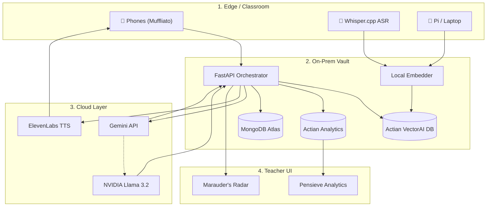

<div align="center">
  <picture>
    
  </picture>
</div>

> A real-time "mind-reading" layer for live classrooms. It detects *where* and *when* students collectively get lost, then instantly re-explains that exact moment using a freshly-generated analogy pulled from each student's own interest graph — with all retrieval running **on-prem on Actian VectorAI DB** so student data never leaves the castle.

*"Professors, you've all taught a room where 40% silently drowned — and you never knew. **Legilimens** is the radar that catches it, and the spell that fixes it, in under a second, on the school's own server."*


<div align="center">
  
</div>

In the Grand Halls of learning, students often hesitate to interrupt a professor to say "I don't get it." As a result, professors power through material while a silent majority falls into the abyss. 

**Legilimens** acts as a silent, telepathic feedback loop between students and Headmasters. When multiple students indicate confusion (via a simple web button), the system:
1. **Captures** the exact audio, video frames, and transcript of what the professor was teaching at that exact second.
2. **Retrieves** past analogies or contextual chunks from the school's localized knowledge vault (the Room of Requirement).
3. **Generates** a custom, deeply resonant analogy based on the student's personal interests (e.g., explaining pointers using Quidditch or potion brewing).
4. **Delivers** this analogy back to the confused student instantly via text and voice, without interrupting the flow of the class.


<div align="center">
  
</div>

We achieve this through a highly optimized, dual-layer architecture combining **edge-based semantic retrieval** and **cloud-based generative AI**.

1. **Continuous Capture:** A local Raspberry Pi or laptop (Edge) records the professor's lecture using `Whisper.cpp` (Audio ASR) and periodic screen captures (Vision/OCR).
2. **On-Prem Data Vault:** All lecture context (transcripts, OCR text, slides) is embedded locally using a `bge-small` embedder and stored securely on an on-premise **Actian VectorAI DB**.
3. **Confusion Pings:** Students tap a "Muffliato" button on their phones when lost.
4. **Contextual RAG Pipeline:** When a ping is received, our FastAPI orchestrator performs a semantic search on the Actian VectorAI DB to grab the exact lecture context of that moment.
5. **Generative Personalization:** The context is sent to the **Gemini API** (with a fallback to **NVIDIA NIM Llama 3.2**) to generate a bespoke analogy.
6. **Voice Synthesis:** The personalized analogy is synthesized into natural speech via **ElevenLabs** and played quietly to the student.
7. **Teacher Analytics:** Post-lecture, the professor uses the **Pensieve Dashboard**, powered by Actian Vector Analytics (columnar SQL), to review the most confusing moments of the lecture.


<div align="center">
  
</div>

Built for a Harry-Potter-themed hackathon, every component carries a spell name reflecting its magical role:

| Spell | Component | Technical Implementation | Purpose |
|---|---|---|---|
| **Muffliato** | Confusion Capture | Next.js 14 PWA, WebSockets | Quietly listens to "I'm lost" pings from student phones without disrupting class. |
| **Marauder's Radar** | Real-time Viz | D3.js Radial Heatmap + React | Shows professors where minds are wandering, live. |
| **Accio Analogy** | Retrieval Engine | Actian VectorAI DB, `bge-small` | Summons the best past explanation from the school's highly secure knowledge vault. |
| **Gemino** | Analogy Rewriter | Gemini API / NVIDIA NIM Fallback | Reshapes the explanation using the student's interest graph. |
| **Sonorus** | Voice Re-delivery | ElevenLabs TTS | Speaks the analogy back calmly and clearly. |
| **Pensieve** | Teacher Analytics | Actian Vector (Columnar SQL) | Re-view the lecture's worst moments and re-teach plans. |


<div align="center">
  
  
</div>

<details>
<summary><b>📜 Click here to view the Architecture Diagram in ASCII format (Mobile Friendly Fallback)</b></summary>
<br>

```text
+-------------------------------------------------+
|         1. THE EDGE (Classroom Layer)           |
|                                                 |
|  [📱 Student Phones]      [🎤 Whisper.cpp ASR]  |
|    (Muffliato PWA)         (Captures Spells)    |
|             \                     /             |
|              v                   v              |
|       [🍓 Raspberry Pi / Capture Device]        |
+----------------------|--------------------------+
                       | (Data flow)
+----------------------V--------------------------+
|       2. THE SCHOOL VAULT (On-Prem Server)      |
|                                                 |
|  [FastAPI Orchestrator] <--> [Local Embedder]   |
|            |                   (bge-small)      |
|            v                                    |
| [Actian VectorAI DB] <--> [Actian Vector SQL]   |
| (Semantic Retrieval)      (Analytics Engine)    |
+----------------------|--------------------------+
                       | (Generative RAG)
+----------------------V--------------------------+
|          3. THE CLOUD (Magic Layer)             |
|                                                 |
|  [Google Gemini API]  OR  [NVIDIA Llama 3.2]    |
|   (Analogy Creator)       (Vision Fallback)     |
|                      |                          |
|             [ElevenLabs TTS]                    |
|             (Voice Synthesis)                   |
+-------------------------------------------------+
```
</details>

<details>
<summary><b>📜 Click here to view the Architecture Diagram in Mermaid flowchart</b></summary>
<br>


</details>


<div align="center">
  
</div>

Follow these steps to brew the complete Legilimens stack locally.

### 1. Requirements (The Ingredients)
- **Docker** and **Docker Compose**
- **Node.js** (v18+) and **npm**
- **Python 3.10+**

### 2. Environment Variables & API Keys
Before casting your first spell, you must configure your API keys.

1. Navigate to the `backend` directory.
2. Copy the `.env.example` file to `.env`:
   ```bash
   cd backend
   cp .env.example .env
   ```
3. Open `.env` and fill in the required keys.

#### 🗝️ Required API Keys:
| Service | Purpose | How to Get It |
|---|---|---|
| **Gemini API Key** | Primary Analogy Engine | Get a free key from [Google AI Studio](https://aistudio.google.com/). |
| **NVIDIA API Key** | Llama 3.2 Fallback (OCR/Vision) | Register at [NVIDIA Build](https://build.nvidia.com/) for free tier credits. |
| **ElevenLabs API Key** | Voice Synthesis (TTS) | Create an account at [ElevenLabs](https://elevenlabs.io/) and generate an API key in your profile settings. |
| **MongoDB URI** | User Auth / Profiles | Create a free cluster on [MongoDB Atlas](https://www.mongodb.com/atlas), grab the connection string, and replace `<password>` with your database user password. |

### 3. Summon the Actian VectorAI Database
We use Docker to spin up the Actian DB locally. Ensure Docker is running.
```bash
# Accept the EULA and run Actian VectorAI DB on ports 6573-6575
docker run -d --name vectorai -p 6573-6575:6573-6575 -e ACTIAN_VECTORAI_ACCEPT_EULA=YES actian/vectorai:latest
```

### 4. Ignite the FastAPI Backend
Open a new terminal window:
```bash
cd backend
python3 -m venv .venv
source .venv/bin/activate
pip install -r requirements.txt
uvicorn main:app --reload --host 0.0.0.0 --port 8000
```
> The API will be available at `http://localhost:8000`. You can view the spellbook at `http://localhost:8000/docs`.

### 5. Launch the Next.js Frontend
Open a new terminal window:
```bash
cd frontend
npm install
npm run dev
```
> The magical web interface will be available at `http://localhost:3000`.

### 6. Local ASR (Whisper.cpp) - *Optional Stretch Goal*
The core demo utilizes a pre-recorded, pre-transcribed lecture. If you wish to run live ASR on an edge device:
```bash
git clone https://github.com/ggerganov/whisper.cpp.git
cd whisper.cpp && make base.en
./main -m models/ggml-base.en.bin -f audio.wav
```


<div align="center">
  
</div>

This project was proudly built targeting the **Education** track, leveraging:
- **Actian** (Primary DB + Vector Search)
- **Gemini** (Primary LLM Engine)
- **NVIDIA NIM** (Vision/OCR Fallback)
- **ElevenLabs** (Voice TTS)
- **MongoDB** (User Graph)
- **GitHub** (Version Control)

<div align="center">
  
</div>

MIT License — Copyright (c) 2026 Sourodyuti Biswas Sanyal. See [`LICENSE`](./LICENSE).
