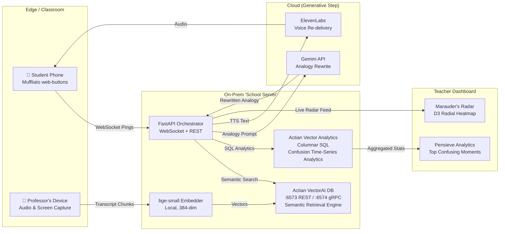

# Legilimens 🔮

> A real-time "mind-reading" layer for live classrooms. It detects *where* and *when* students collectively get lost, then instantly re-explains that exact moment using a freshly-generated analogy pulled from each student's own interest graph — with all retrieval running **on-prem on Actian VectorAI DB** so student data never leaves the building.

*"Professors, you've all taught a room where 40% silently drowned — and you never knew. **Legilimens** is the radar that catches it, and the spell that fixes it, in under a second, on the school's own server."*

Built for a Harry-Potter-themed hackathon. Every component carries a spell name:

| 🪄 Spell | 🧩 Component | ⚙️ Technical Implementation | 🎯 Purpose |
|:---|:---|:---|:---|
| **Muffliato** | Confusion Capture | Next.js 14 PWA, WebSockets | Quietly listens to "I'm lost" pings from student phones without disrupting class. |
| **Marauder's Radar** | Real-time Viz | D3.js Radial Heatmap + React | Shows professors where minds are wandering, live. |
| **Accio Analogy** | Retrieval Engine | **Actian VectorAI DB**, `bge-small` | Summons the best past explanation from the school's highly secure knowledge vault. |
| **Gemino** | Analogy Rewriter | Gemini API | Reshapes the explanation using the student's interest graph. |
| **Sonorus** | Voice Re-delivery | ElevenLabs TTS | Speaks the analogy back calmly and clearly. |
| **Pensieve** | Teacher Analytics | **Actian Vector (Columnar SQL)** | Re-view the lecture's worst moments and re-teach plans. |

---

## Quick Start

```bash
# 1. Start Actian VectorAI DB (retrieval brain, on-prem)
docker run -d --name vectorai -p 6573-6575:6573-6575 \
  -e ACTIAN_VECTORAI_ACCEPT_EULA=YES actian/vectorai:latest

# 2. Backend
python3 -m venv .venv && source .venv/bin/activate
cd backend && pip install -r requirements.txt
cp .env.example .env  # Add your API keys
uvicorn main:app --reload --host 0.0.0.0 --port 8000

# 3. Frontend  (another terminal)
cd frontend && npm install && npm run dev

# 4. Stealth overlay client  (optional, another terminal)
cd stealth-client && npm install && npm start
```

Access:

| Service | URL |
|---|---|
| Student PWA (Muffliato) | http://localhost:3000/muffliato |
| Teacher Dashboard (Marauder's Radar + Pensieve) | http://localhost:3000/dashboard |
| Backend API docs (FastAPI Swagger) | http://localhost:8000/docs |
| VectorAI DB LocalUI | http://localhost:6575 |

One-command bring-up (Docker Compose, for the "school server" laptop):

```bash
docker-compose up -d
```

> ⚠️ **Verify Docker images:** Confirm the Actian image tags against Actian's docs before first `docker-compose up`. See `# TODO VERIFY` markers in [`docker-compose.yml`](./docker-compose.yml).

---

## Architecture

<details>
<summary><b>📜 Click to expand — ASCII diagram</b></summary>

```text
+-------------------------------------------------------------------+
|                       1. EDGE / CLASSROOM                         |
|                                                                   |
|       [📱 Student Phone]              [🎤 Professor's Device]     |
|    (Muffliato web-buttons)            (Audio & Screen Capture)    |
|               ^       |                           |               |
+---------------|-------|---------------------------|---------------+
         (Audio)|       |(WebSocket Pings)          |(Transcript)
                |       v                           v
+---------------|---------------------------------------------------+
|               |       2. ON-PREM 'SCHOOL SERVER'                  |
|               |                                                   |
|               |    [FastAPI Orchestrator]      [bge-small Embedder]|
|               |      (WebSocket + REST)          (Local, 384-dim) |
|               |         |           |                     |       |
|               |         |           +-----------------+   |       |
|               |  (SQL)  v            (Semantic Search)v   v(Vectors)
|               | [Actian Analytics]       [Actian VectorAI DB]     |
|               |   (Columnar SQL)       (Semantic Retrieval Engine)|
+---------------|---------|---^-------------------------------------+
                |         |   |
     (TTS Text) | (Prompt)|   |(Rewritten Analogy)
                |         v   |
+---------------|---------------------------------------------------+
|               |        3. CLOUD (Generative Step)                 |
|               |                                                   |
|               |            [Google Gemini API]                    |
|               |             (Analogy Rewrite)                     |
|               |                                                   |
|               +----------- [ElevenLabs TTS]                       |
|                          (Voice Re-delivery)                      |
+-------------------------------------------------------------------+

+-------------------------------------------------------------------+
|                       4. TEACHER DASHBOARD                        |
|                                                                   |
|        [Marauder's Radar]              [Pensieve Analytics]       |
|       (D3 Radial Heatmap)            (Top Confusing Moments)      |
+-------------------------------------------------------------------+
```

</details>

<details>
<summary><b>📜 Click to expand — Mermaid diagram</b></summary>



</details>

The defining structural choice: **the entire student-data path (capture → embed → retrieve → analytics) lives inside the "school server" laptop.** Only the final analogy rewrite + voice cross the network, and that payload is anonymized text. Pull the Ethernet cable and the radar, retrieval, and analytics still work.

---

## How It Works

In the Grand Halls of learning, students hesitate to interrupt a professor mid-lecture. As a result, professors power through material while a silent majority falls behind. Legilimens acts as a silent, telepathic feedback loop between students and their professors.

### The 7-Step Pipeline

**1. Continuous Capture** — The professor's lecture is recorded locally (audio/transcript and screen capture). Whisper.cpp transcribes audio in ~15s chunks; the Gemini Vision service analyzes screen frames to identify the active concept node.

**2. Actian VectorAI Data Vault** — All lecture context (transcripts, OCR text, slide content) is embedded locally using the `bge-small-en` model (384-dim, CPU) and stored natively in Actian VectorAI DB, which provides lightning-fast semantic retrieval via gRPC endpoints. The `lecture_chunks` collection grows continuously as the lecture progresses.

**3. Confusion Pings** — Students tap the "🪄 Muffliato" button on their phones when lost. The Muffliato PWA sends a WebSocket `ping` to FastAPI with `{student_id, signal_type, lecture_id}`. The radar flares red within **<100ms**.

**4. Actian Contextual RAG Pipeline** — When ≥2 distinct students signal `lost` within a 20-second sliding window on the same concept (with a 30-second cooldown), the FastAPI orchestrator fires **Accio Analogy**: it embeds the confusing chunk, queries Actian VectorAI DB for the top-3 semantically similar past explanations via cosine distance, then applies BM25 + vector RRF fusion for better precision on keyword-heavy confusing phrases.

**5. Generative Personalization** — The Actian-retrieved context is sent to Gemini 2.0 Flash with a student-interest prompt: *"Rewrite as a 2-sentence analogy for a {cricketer/gamer/cook}."* Falls back to NVIDIA NIM if Gemini returns 429.

**6. Voice Synthesis** — The personalized analogy is synthesized into natural speech via ElevenLabs (`eleven_flash_v2_5`) and streamed quietly back to the student's phone via WebSocket `analogy_ready` + `latency_badge` messages — without interrupting the class.

**7. Teacher Analytics (Pensieve)** — Post-lecture, the professor reviews the Pensieve Dashboard. Actian Vector columnar SQL queries the `confusion_events` table for the top-N most confusing moments ranked by `lost_count × minutes_wasted`, rolling 60s density timelines, and per-cohort heatmaps.

### Latency Budget

| Stage | Target | Service |
|---|---|---|
| Ping → Radar | < 100ms | FastAPI WebSocket broadcast |
| Chunk embedding | < 30ms | bge-small-en (CPU) |
| VectorAI DB search | < 50ms | Actian VectorAI DB (on-prem) |
| Gemini rewrite | ~800ms | Gemini 2.0 Flash |
| ElevenLabs TTS | ~600ms | eleven_flash_v2_5 |
| **Total** | **~1.5s** | End-to-end pipeline |

All latency numbers are displayed live on the teacher dashboard as a `latency_badge` overlay — sent as a separate WebSocket message type so the badge component can animate independently without re-rendering the full analogy pane.

---

## Project Structure

```
TeamTraction/
├── backend/                        # FastAPI orchestrator
│   ├── main.py                     # App entry point, lifespan, router mounts
│   ├── config.py                   # All settings via pydantic-settings + .env
│   ├── dependencies.py             # FastAPI dependency injection singletons
│   ├── logging_config.py           # Structured JSON logging setup
│   ├── models/
│   │   ├── schemas.py              # Pydantic models (StudentPing, AnalogyResponse, …)
│   │   └── database.py             # Actian Vector connection pool + SQLite fallback
│   ├── routers/
│   │   ├── websocket.py            # WebSocket hub — ConnectionManager, ThresholdTracker, OfflineQueue
│   │   ├── retrieval.py            # Accio Analogy endpoint (embed → search → rewrite → TTS)
│   │   ├── analytics.py            # Pensieve SQL endpoints (top-moments, density, cohort-heatmap)
│   │   ├── asr.py                  # Whisper transcript ingestion + current-chunk tracker
│   │   ├── auth.py                 # JWT auth (MongoDB Atlas user store)
│   │   ├── recording.py            # Lecture recording management
│   │   ├── transcription.py        # Transcript upload + chunking
│   │   ├── tts.py                  # ElevenLabs TTS proxy endpoint
│   │   ├── videos.py               # Lecture video management
│   │   └── vision.py               # Gemini Vision screen-context detection
│   └── services/
│       ├── vectorai_client.py      # Actian VectorAI DB SDK wrapper (upsert, search, multimodal)
│       ├── vector_client.py        # Actian Vector (columnar SQL) analytics client
│       ├── hybrid_search.py        # BM25Index + HybridSearchEngine (RRF fusion)
│       ├── embedder.py             # bge-small-en sentence-transformer wrapper (384-dim)
│       ├── gemini_client.py        # Gemino: analogy rewrite via Gemini 2.0 Flash
│       ├── gemini_vision.py        # Screen frame analysis via Gemini Vision
│       ├── elevenlabs_client.py    # Sonorus: ElevenLabs TTS client
│       ├── mongodb_client.py       # MongoDB Atlas client for auth
│       ├── nvidia_client.py        # NVIDIA NIM fallback LLM
│       ├── offline_cache.py        # Pre-cached analogies for offline / demo mode
│       ├── ratelimit.py            # Token-bucket rate limiting middleware (60 req/min/IP)
│       ├── recording_service.py    # Recording lifecycle management
│       └── whisper_service.py      # Whisper.cpp subprocess integration
├── frontend/                       # Next.js 14 TypeScript PWA
│   └── src/
│       ├── app/
│       │   ├── page.tsx            # Landing page (Hogwarts theme, spell explainers)
│       │   ├── muffliato/          # Student confusion buttons PWA
│       │   ├── dashboard/          # Teacher dashboard (Marauder's Radar + Pensieve)
│       │   ├── overlay/            # Stealth overlay page (loaded by Electron client)
│       │   ├── login/              # Auth login page
│       │   └── register/           # Auth registration page
│       ├── components/
│       │   ├── radar/              # D3 radial heatmap (Marauder's Radar)
│       │   ├── timeline/           # Recharts confusion timeline
│       │   ├── capture/            # Screen capture UI components
│       │   ├── overlay/            # Always-on-top overlay components
│       │   ├── presentation/       # Lecture presentation components
│       │   ├── landing/            # Landing page sections
│       │   ├── dashboard/          # Dashboard layout + panels
│       │   └── ui/                 # Shared UI primitives
│       ├── hooks/
│       │   ├── useWebSocket.ts     # WebSocket connection + message dispatch
│       │   ├── useRadarData.ts     # Radar data aggregation from WebSocket feed
│       │   ├── useConfusionWave.ts # Confusion wave animation hook
│       │   ├── useDashboardPolling.ts # REST polling for analytics data
│       │   ├── useAuth.ts          # Auth state + JWT management
│       │   ├── useLectureRecording.ts # Recording lifecycle hook
│       │   ├── useScreenCapture.ts # Electron screen capture IPC hook
│       │   ├── useScreenShare.ts   # WebRTC screen share hook
│       │   ├── useOverlayState.ts  # Overlay show/hide + sizing state
│       │   └── useLatencyHistory.ts # Latency badge history + sparkline data
│       ├── lib/
│       │   ├── api.ts              # FastAPI REST client (typed)
│       │   ├── types.ts            # Shared TypeScript types
│       │   └── design-tokens.ts    # Hogwarts colour palette + CSS token map
│       └── services/               # Frontend service layer
├── stealth-client/                 # Electron always-on-top overlay
│   ├── main.js                     # Electron main process — frameless window, screen capture IPC
│   ├── preload.js                  # Context bridge (secure IPC to renderer)
│   └── package.json
├── data-prep/                      # Sample lecture data for demo pre-loading
├── scripts/
│   ├── start_demo.sh               # One-command demo start (starts all services + seeds data)
│   └── demo_setup.sh               # Pre-loads knowledge base with backprop lecture chunks
├── nginx/                          # Nginx reverse proxy config (production)
├── mcp/                            # MCP server configs
├── docker-compose.yml              # Dev: VectorAI DB + Actian Vector + FastAPI + Frontend
├── docker-compose.prod.yml         # Production: cloud-only (no Actian containers)
├── do.app.yaml                     # DigitalOcean App Platform spec
├── deploy.sh                       # Automated deployment script
└── .env.example                    # All required env vars with comments
```

---

## Environment Variables

Create `backend/.env` (copy from `backend/.env.example`):

```bash
# ── Actian VectorAI DB (retrieval brain, on-prem) ──────────────────────
VECTORAI_HOST=localhost
VECTORAI_PORT=6574          # gRPC port (REST is 6573)
VECTORAI_COLLECTION=lecture_chunks
VECTORAI_DIM=384
ACTIAN_LICENSE_KEY=         # Community Edition: 5,000 vectors free

# ── Actian Vector (columnar analytics, on-prem) ────────────────────────
VECTOR_HOST=localhost
VECTOR_PORT=5432
VECTOR_DATABASE=actian
VECTOR_USER=admin
VECTOR_PASSWORD=password

# ── MongoDB Atlas (user auth) ──────────────────────────────────────────
MONGODB_URI=                # Leave blank to disable auth endpoints

# ── Cloud generative step ─────────────────────────────────────────────
GEMINI_API_KEY=             # gemini-2.0-flash-lite (analogy rewrite)
ELEVENLABS_API_KEY=         # eleven_flash_v2_5 (voice re-delivery)
NVIDIA_API_KEY=             # NIM fallback (optional)

# ── JWT Auth ──────────────────────────────────────────────────────────
JWT_SECRET_KEY=             # Generate: openssl rand -hex 32
JWT_ALGORITHM=HS256
ACCESS_TOKEN_EXPIRE_MINUTES=30

# ── Whisper.cpp (local ASR — stretch goal, not required for demo) ───────
WHISPER_MODEL_PATH=./models/ggml-base.en.bin

# ── CORS (frontend origins) ────────────────────────────────────────────
CORS_ORIGINS=["http://localhost:3000","http://127.0.0.1:3000"]
```

---

## Key Components Deep-Dive

### WebSocket Hub (`routers/websocket.py`)

Three classes power the real-time layer:

- **`ConnectionManager`** — Manages WebSocket connections partitioned by `lecture_id` and `student_id/role`. Supports up to 200 connections per lecture, 10 teacher connections. Provides `broadcast_to_lecture()`, `send_to_student()`, and `send_teacher_alert()`.

- **`ThresholdTracker`** — Sliding-window deque per `(lecture_id, concept_node)`. Records `lost` signals and fires when ≥2 unique students signal within 20 seconds, with a 30-second cooldown to prevent alert spam.

- **`OfflineQueue`** — Async in-memory queue for buffering student pings when the Wi-Fi drops. Flushes on reconnect.

WebSocket message types:

| Direction | Type | Description |
|---|---|---|
| Server → All | `radar_update` | Every ping — updates the radar heatmap |
| Server → Teacher | `confusion_alert` | Threshold crossed for a concept node |
| Server → All | `analogy_ready` | Full Accio pipeline result (text + audio URL) |
| Server → All | `latency_badge` | Flat numeric latency breakdown for the overlay badge |
| Server → Client | `error` | Sent only to the offending connection |
| Client → Server | `ping` | Student confusion signal (lost / got_it / slower) |
| Client → Server | `teacher_alert_dismiss` | Teacher dismisses an alert |

### Retrieval Pipeline (`routers/retrieval.py` + `services/`)

The `run_retrieval_pipeline()` function is the heart of Accio Analogy. Called by the WebSocket hub on threshold fire (or directly via `POST /retrieval/accio`):

1. `Embedder.encode_with_latency(chunk_text)` → 384-dim vector via `bge-small-en`
2. `VectorAIClient.search_similar(query_vector, limit=3)` → cosine similarity search against `lecture_chunks` collection
3. Optionally: `HybridSearchEngine.search()` → BM25 + vector RRF fusion for better precision
4. `GeminiClient.rewrite_analogy(concept_node, best_text, avatar)` → Gemini 2.0 Flash with avatar-tailored prompt (falls back to NVIDIA NIM, then raw text)
5. `ElevenLabsClient.synthesize(analogy_text)` → TTS audio bytes (falls back to text-only)

Graceful degradation: embedder/VectorAI down → 503; Gemini down → raw retrieved text; ElevenLabs down → text only.

### Actian VectorAI DB (`services/vectorai_client.py`)

Wraps the official `actian-vectorai-client` SDK. Key operations:

- `create_lecture_chunks_collection()` — Idempotent collection creation (384-dim, Cosine distance)
- `upsert_chunks(points)` — Batch upsert with UUID→int ID conversion
- `search_similar(query_vector, limit, filter)` — Primary semantic search; falls back to Python-side filtering if the DB filter API is unavailable
- `search_filtered(...)` — Structured field filters (topic_node, difficulty range, timestamp range)
- `create_multimodal_collection()` — Named vectors (`text` + `context`, both 384-dim) for cross-modal retrieval
- `search_cross_modal(text_vector, context_vector)` — Weighted score combination across named vectors

### Hybrid Search Engine (`services/hybrid_search.py`)

`BM25Index` implements in-memory BM25 (k1=1.5, b=0.75) with stopword filtering. `HybridSearchEngine` combines BM25 keyword scores and VectorAI DB semantic scores using **Reciprocal Rank Fusion (RRF)** — both result lists are ranked independently, then merged by `1 / (k + rank)` weighting, giving better recall than pure vector search for short, keyword-heavy confusing phrases.

### Pensieve Analytics (`routers/analytics.py`)

Columnar SQL queries against Actian Vector's `confusion_events` table:

| Endpoint | Query | Returns |
|---|---|---|
| `GET /analytics/top-moments` | `SELECT concept_node, COUNT(*) as lost_count … GROUP BY … ORDER BY lost_count DESC LIMIT N` | Top-N most confusing concept nodes |
| `GET /analytics/density` | Rolling 60s window `COUNT(*)` grouped by 5s buckets | Confusion density timeline for Recharts |
| `GET /analytics/cohort-heatmap` | `GROUP BY cohort, concept_node` | Per-cohort breakdown heatmap |
| `GET /analytics/summary` | Aggregate `COUNT`, `AVG`, `MAX` across lecture | Lecture-level summary stats |
| `POST /analytics/seed` | INSERT synthetic events | Seed demo data for testing |

Falls back to SQLite automatically when Actian Vector is not reachable (development mode).

### Gemini Vision (`services/gemini_vision.py`)

Analyzes screen frames captured by the stealth Electron overlay. Sends a screenshot as a base64 image to `gemini-2.5-flash` with a structured JSON prompt requesting:

```json
{
  "topic_node": "snake_case_topic_name",
  "full_text_transcription": "...",
  "diagram_descriptions": "...",
  "comprehensive_summary": "...",
  "brief_summary": "...",
  "difficulty": 1-10,
  "key_terms": ["..."]
}
```

Has a 429 circuit breaker — backs off automatically when rate-limited, with a configurable cooldown. The detected `topic_node` is used to tag live confusion pings to the correct concept.

### Stealth Electron Overlay (`stealth-client/`)

A frameless, transparent, always-on-top Electron window (420×680px, top-right corner) that loads the Next.js `/overlay` page. Used during lectures to:

- Show the Marauder's Radar mini-view without switching windows
- Capture the primary screen via `desktopCapturer` and send it to Gemini Vision for auto topic-detection
- Register `Ctrl+Shift+1` as a global shortcut to trigger manual screen analysis

Has Wayland compatibility (`WebRTCPipeWireCapturer`, hardware acceleration disabled) and macOS screen-recording permission checks. Content protection is enabled — the overlay window cannot be captured in screen recordings.

---

## Docker Services

| Service | Image | Ports | Profile |
|---|---|---|---|
| `vectorai-db` | `actian/vectorai:latest` | 6573 (REST), 6574 (gRPC), 6575 (LocalUI) | default |
| `actian-vector` | `actian/vector5.0:community` | 5432 | `onprem` |
| `fastapi` | `./backend` (Dockerfile) | 8001 | default |
| `frontend` | `./frontend` (Dockerfile) | 3000 | default |

Start the analytics engine explicitly:

```bash
# With Actian Vector columnar engine (on-prem profile)
docker-compose --profile onprem up -d

# Without Actian Vector (uses SQLite fallback for analytics)
docker-compose up -d
```

---

## Development Commands

### Backend

```bash
cd backend
source ../.venv/bin/activate

# Dev server
uvicorn main:app --reload --host 0.0.0.0 --port 8000

# Tests
pytest -v

# Type check
mypy .

# Pre-warm embedder (downloads ~100MB on first run)
python -c "from sentence_transformers import SentenceTransformer; SentenceTransformer('BAAI/bge-small-en')"
```

### Frontend

```bash
cd frontend

npm run dev          # Dev server (http://localhost:3000)
npm run build        # Production build
npm run lint         # ESLint
npm run typecheck    # tsc --noEmit
```

### Stealth Client

```bash
cd stealth-client

npm install
npm start            # Launches Electron overlay (requires frontend on :3000)
```

### Whisper.cpp (optional local ASR)

```bash
git clone https://github.com/ggerganov/whisper.cpp.git
cd whisper.cpp && make base.en

# Test
./main -m models/ggml-base.en.bin -f audio.wav
```

> The core demo uses a **pre-recorded, pre-transcribed** lecture so Whisper.cpp is a stretch goal, not a dependency.

---

## Demo Script (3 minutes)

| Time | Action |
|---|---|
| 0:00–0:20 | Hook: *"Professors, 40% silently drown — watch the radar catch it."* Show empty radar. |
| 0:20–1:20 | Live play: 90s dense lecture (backprop). Judges press "🪄 I'm lost" at confusing moment. Radar flares red on "chain rule". |
| 1:20–2:00 | Actian moment: badge shows `edge retrieval: 38ms · 0 cloud calls`. VectorAI DB returns best explanation; Gemini rewrites for "cricketer"; ElevenLabs speaks it. |
| 2:00–2:40 | Pensieve: confusion heatmap timeline, top-3 worst moments ranked by `students lost × minutes wasted`, one-click "re-teach plan". |
| 2:40–3:00 | Punchline + unplug: *"Runs entirely on school's server."* Pull Ethernet cable. Radar still updates, retrieval still 38ms, analytics still query. Plug back in. |

---

## Sponsor Tracks

**Actian** (primary) — Dual Actian DB architecture (VectorAI DB + Vector columnar engine + Zen edge buffer)

| Track | Usage |
|---|---|
| Actian VectorAI DB | On-prem semantic retrieval, `lecture_chunks` collection |
| Actian Vector | Columnar SQL analytics, `confusion_events` time-series |
| Actian Zen | Edge buffer for offline student pings on Pi |
| Gemini API | Analogy rewrite (`gemini-2.0-flash-lite`), screen analysis (`gemini-2.5-flash`) |
| ElevenLabs | Voice re-delivery (`eleven_flash_v2_5`) |
| DigitalOcean | Optional cloud droplet for multi-school dashboard view |
| GitHub | Education track |

---

## API Reference

### Health

```
GET /health
```
Returns liveness + dependency status for embedder, VectorAI DB, and Actian Vector.

```
GET /metrics
```
Returns active WebSocket connections, lecture count, and component readiness.

### WebSocket

```
WS /ws/lecture/{lecture_id}?role=student&student_id=alice
WS /ws/lecture/{lecture_id}?role=teacher
```

### Retrieval

```
POST /retrieval/accio
Body: { "concept_node": "...", "chunk_text": "...", "avatar": "cricketer" }
```

### Analytics

```
GET /analytics/top-moments?lecture_id=1&limit=3
GET /analytics/density?lecture_id=1&window_seconds=60
GET /analytics/cohort-heatmap?lecture_id=1
GET /analytics/summary?lecture_id=1
POST /analytics/seed
```

### Transcription / ASR

```
POST /asr/chunk          # Ingest a Whisper transcript chunk
GET  /asr/current/{lid}  # Get current live concept node for lecture {lid}
POST /transcription/upload
```

### Vision

```
POST /vision/analyze     # Send a base64 screenshot, get topic_node + summary back
```

---

## Offline Mode

Pull the Ethernet cable. The following still work without internet:

| Capability | Status offline |
|---|---|
| Muffliato pings → Radar | ✅ WebSocket is local |
| VectorAI DB similarity search | ✅ On-prem Docker |
| Actian Vector SQL analytics | ✅ On-prem Docker |
| Confusion heatmap + Pensieve | ✅ On-prem Docker |
| Analogy rewrite (Gemini) | ❌ Requires internet |
| Pre-cached analogy (demo mode) | ✅ `services/offline_cache.py` |
| ElevenLabs TTS | ❌ Requires internet |

For demo safety, `offline_cache.py` ships one pre-cached analogy for the "backprop → chain rule" concept. If Gemini is unreachable, the pipeline returns the cached analogy silently.

---

## Requirements

- **Python 3.11+** (backend)
- **Node.js 18+** (frontend + stealth client)
- **Docker + Docker Compose** (for Actian VectorAI DB)
- **Modern browser** (Chrome, Firefox, Edge) with WebSocket support
- API keys: `GEMINI_API_KEY`, `ELEVENLABS_API_KEY` (optional for core demo)

No GPU required — `bge-small-en` runs comfortably on CPU.

---

## Diagnostics

If something doesn't work:

1. **VectorAI DB not connecting** → Check `docker ps` — `legilimens-vectorai` should be `healthy`. Check `VECTORAI_HOST`/`VECTORAI_PORT` in `.env`. Port 6574 is gRPC (used by the SDK), 6573 is REST (used by health checks).

2. **Embedder fails to load** → First run downloads ~100MB from HuggingFace. Ensure internet access or pre-cache the model: `python -c "from sentence_transformers import SentenceTransformer; SentenceTransformer('BAAI/bge-small-en')"`.

3. **Radar doesn't update** → Open browser DevTools → Network → WS tab. You should see a WebSocket connection to `/ws/lecture/1`. If missing, check `CORS_ORIGINS` in `.env` includes your frontend origin.

4. **Analogy not spoken** → Check `ELEVENLABS_API_KEY`. If missing, the response returns text only — audio_url will be null. This is expected graceful degradation.

5. **Analytics dashboard shows 0 events** → Run `POST /analytics/seed` to insert demo data, or trigger the Muffliato buttons a few times and wait for the 60s analytics window.

6. **Stealth overlay blank** → Ensure frontend is running on `:3000` before starting the Electron client. On Linux/Wayland, the `WebRTCPipeWireCapturer` flag is applied automatically.

7. **`actian_vectorai` SDK not found** → `pip install actian-vectorai-client`. Carry the wheel on USB for offline hackathon environments.

---

## Planning Docs

- [`CLAUDE.md`](./CLAUDE.md) — Full technical detail + implementation order (35-hour plan)
- [`DEPLOY.md`](./DEPLOY.md) — DigitalOcean + production deployment guide
- [`context.md`](./context.md) — Context and background
- [`handoff.md`](./handoff.md) — Team handoff notes
- [`Legilimens — Full Build Blueprint.md`](<./Legilimens — Full Build Blueprint.md>) — Original spec

---

## License

MIT License — Copyright (c) 2026 Sourodyuti Biswas Sanyal. See [`LICENSE`](./LICENSE).
