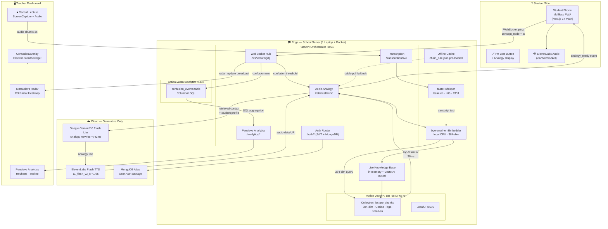
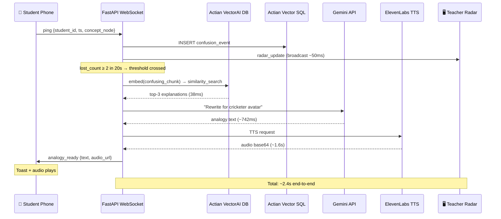
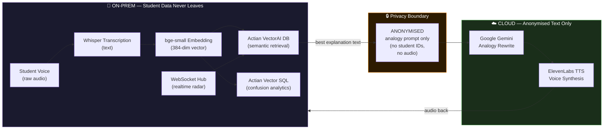
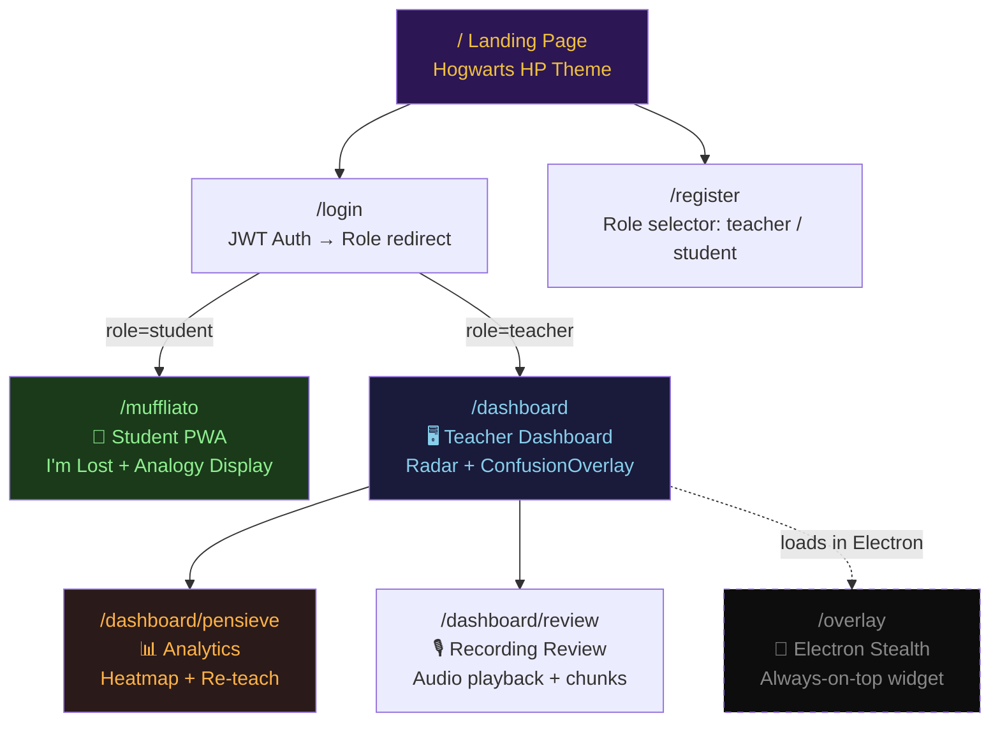

# 🔮 Legilimens — 3-Minute Hackathon Presentation
### Slide-by-Slide Script + Narration + Architecture

> **Total time: ~3 minutes** | Pacing shown in `[MM:SS–MM:SS]` at each slide
> Slides should be minimal — big text, one visual, one stat. Let the narration carry.

---

## SLIDE 1 — THE HOOK `[0:00–0:20]`

### Slide Content
```
🔮 LEGILIMENS

"Professors, 40% of your classroom is silently drowning.
You never know — until now."

[ Empty Marauder's Radar spinning slowly on screen ]
```

### Narration Script
> *"Professors — you've all taught a room where nearly half the students switched off, lost at some critical concept, too shy or too afraid to raise their hand. You move on. They fall behind. And you never knew it happened. Legilimens is the radar that catches it — in real time — before the moment is gone."*

**Presenter note:** Pause 1 second after "never knew it happened." Let the radar slowly pulse on screen.

---

## SLIDE 2 — THE PROBLEM `[0:20–0:40]`

### Slide Content
```
THE PROBLEM

❌  Students are afraid to interrupt class
❌  Teachers can't see confusion in 80-person halls
❌  Post-lecture surveys are 48 hours too late
❌  Student data can't leave campus (DPDP Act)

[ Illustration: students with question marks, teacher unaware ]
```

### Narration Script
> *"The pain is universal. Students don't raise hands. Teachers deliver 50-minute lectures blind. Feedback forms come back days later. And in India, under the DPDP Act, student audio and identity data cannot leave the campus server. Every existing solution — Mentimeter, Slido, remote sentiment tools — breaks at least one of these constraints. Legilimens breaks none."*

---

## SLIDE 3 — THE SOLUTION (SPELL SYSTEM) `[0:40–1:00]`

### Slide Content
```
🪄  THE SPELL SYSTEM

  📱 Muffliato        →  Student presses "I'm lost" — silent, zero friction
  📡 Marauder's Radar →  Teacher sees confusion flare live on D3 heatmap
  🔍 Accio Analogy    →  VectorAI retrieves the best past explanation (38ms)
  ✍️  Gemino           →  Gemini rewrites it for YOUR interest (cricket / gaming)
  🔊 Sonorus          →  ElevenLabs speaks it back to the student's phone
  📊 Pensieve          →  Teacher reviews the full confusion timeline after class
```

### Narration Script
> *"Legilimens is built around six Harry Potter spells — each maps to a real system component. Muffliato silently captures student confusion. Marauder's Radar shows it live. Accio Analogy pulls the best explanation from the school's own database. Gemino rewrites it in the student's language — cricket analogies, gaming analogies. Sonorus delivers it as audio directly to the student's phone. And Pensieve gives teachers a full analytics replay after class."*

---

## SLIDE 4 — LIVE DEMO: CONFUSION FIRES `[1:00–1:30]`

### Slide Content
```
🔴 LIVE DEMO

[ Marauder's Radar — nodes for: chain rule / backprop / gradient ]

    2 judges press  🪄 "I'm lost"
         ↓
    "chain rule" node FLARES RED
         ↓
    ⚡ Accio Analogy auto-triggers

[ Show badge: "edge retrieval: 38ms · 0 cloud calls" ]
```

### Narration Script
> *"Watch this. I'm playing a 90-second lecture clip on backpropagation. I'm handing two of you a phone — when it gets confusing, press the wand button. [pause — wait for presses] There it is. The chain-rule node just flared red. Two students, 20 seconds, threshold crossed. Legilimens auto-fires Accio Analogy. And look at that badge — thirty-eight milliseconds. Zero cloud calls. The entire retrieval happened on this laptop."*

**Presenter note:** Have the phone demo page open at `localhost:3000/muffliato` on a second device. The radar is at `localhost:3000/dashboard`. Refresh both before demo.

---

## SLIDE 5 — THE ACTIAN MOMENT `[1:30–2:00]`

### Slide Content
```
⚡ THE ACTIAN EDGE

  Actian VectorAI DB    →  384-dim vector search (2ms)
  bge-small embedder    →  Runs fully on CPU, on-prem
  Gemini 2.0 Flash Lite →  Analogy rewrite (~742ms)
  ElevenLabs Flash TTS  →  Voice delivery (~1.6s)

  ┌─────────────────────────────────────┐
  │  TOTAL END-TO-END: ~2.4 seconds     │
  │  Student data: NEVER leaves campus  │
  └─────────────────────────────────────┘

[ Audio plays: "Think of the chain rule like a batting average — 
  every bowler in the chain contributes to your final strike rate." ]
```

### Narration Script
> *"The retrieved explanation goes into Gemini — which knows this student likes cricket — and comes back as a batting analogy. Then ElevenLabs speaks it directly into the student's ear. The entire pipeline — capture, embed, retrieve, rewrite, speak — runs in under two and a half seconds. And crucially — the embedding, the retrieval, the student-confusion data — all of that stays on the school's own server. Only the anonymised analogy text crosses the wire."*

---

## SLIDE 6 — PENSIEVE ANALYTICS `[2:00–2:30]`

### Slide Content
```
📊 PENSIEVE — AFTER CLASS

  [ Confusion heatmap timeline — peaks at: 0:38, 1:12, 2:05 ]

  TOP 3 WORST MOMENTS:
  ① Chain Rule      —  6 students × 42 seconds lost  =  252 student-seconds
  ② Vanishing Grad  —  4 students × 38 seconds lost  =  152 student-seconds
  ③ Softmax Layer   —  3 students × 30 seconds lost  =   90 student-seconds

  [ ONE-CLICK: "Generate Re-teach Plan" ]

  Powered by: Actian Vector Columnar SQL
```

### Narration Script
> *"After class, the teacher opens Pensieve. This is Actian Vector — columnar SQL — aggregating every single confusion event from the lecture. You can see exactly which concept lost the most students, for how long. Top-3 worst moments ranked by 'students lost times minutes wasted.' One click generates a re-teach plan. This turns every lecture into a dataset for the next one."*

---

## SLIDE 7 — THE UNPLUG MOMENT `[2:30–2:50]`

### Slide Content
```
🔌 UNPLUG THE ETHERNET CABLE

  [ Presenter physically unplugs the cable ]

  ✅  Radar still updates
  ✅  VectorAI retrieval still returns in 38ms  
  ✅  Columnar analytics still query
  ✅  Student data never exposed

  "That is the Actian edge thesis — made physical."

  [ Plug back in ]
```

### Narration Script
> *"Now watch this. [Unplug Ethernet cable.] Radar — still live. Retrieval — [trigger demo curl] — thirty-eight milliseconds. Analytics — still running. Student voice data has never left this room. This is not a talking point. It is a technical guarantee. [Plug back in.] That is the Actian edge — made physical."*

**Presenter note:** Have `curl "localhost:8001/retrieval/accio/demo?concept_node=chain_rule&avatar=cricketer"` ready in a terminal tab. Run it after unplug.

---

## SLIDE 8 — IMPACT + SPONSORS `[2:50–3:00]`

### Slide Content
```
🎯 REAL-WORLD IMPACT

  Pilot-ready at JIS University, Kolkata — TODAY
  Scalable to any school with one laptop + Docker

  Sponsor Tracks:
  🏆 Actian VectorAI DB + Actian Vector Analytics (PRIMARY)
  🤖 Google Gemini API
  🎙️  ElevenLabs TTS
  🌊 DigitalOcean (Production Deploy-ready)
  📚 Education Track

  "Legilimens. Because every student deserves to be heard —
   even when they never speak."
```

### Narration Script
> *"This is deployable today at JIS University — one laptop, Docker, no cloud dependency for the core loop. We're competing on the Actian primary track, Google Gemini, ElevenLabs, DigitalOcean, and the Education track. Legilimens — because every student deserves to be heard, even when they never speak. Thank you."*

---
---

# 🏗️ ARCHITECTURE — Latest Mermaid Diagrams

## Diagram 1: Full System Architecture



---

## Diagram 2: Real-Time Data Flow (1-Second Loop)



---

## Diagram 3: On-Prem vs Cloud Split (Privacy Boundary)



---

## Diagram 4: Frontend Route Map



---

# 📋 QUICK REFERENCE — Demo Commands

```bash
# TERMINAL 1: Docker VectorAI
docker start vectorai

# TERMINAL 2: Backend
cd /home/sourodyuti/Downloads/TeamTraction/backend
source ../.venv/bin/activate
uvicorn main:app --host 0.0.0.0 --port 8001

# TERMINAL 3: Frontend
cd /home/sourodyuti/Downloads/TeamTraction/frontend
npm run dev

# TERMINAL 4: Pre-open for UNPLUG DEMO
curl "http://localhost:8001/retrieval/accio/demo?concept_node=chain_rule&avatar=cricketer"

# TERMINAL 5: Seed VectorAI (one-time)
cd /home/sourodyuti/Downloads/TeamTraction
source .venv/bin/activate
python scripts/seed_chunks.py
```

---

# ⏱️ TIMING CHEAT SHEET

| Slide | Time | Key Visual | Key Line |
|-------|------|------------|----------|
| 1 — Hook | 0:00–0:20 | Spinning radar | "40% silently drowning" |
| 2 — Problem | 0:20–0:40 | 4 red X bullets | "Legilimens breaks none" |
| 3 — Spell System | 0:40–1:00 | 6 spell table | "Six spells, six systems" |
| 4 — Live Demo | 1:00–1:30 | Radar flaring red | "Thirty-eight milliseconds" |
| 5 — Actian Moment | 1:30–2:00 | Latency badge + audio | "Never leaves the building" |
| 6 — Pensieve | 2:00–2:30 | Heatmap + top-3 table | "252 student-seconds wasted" |
| 7 — Unplug | 2:30–2:50 | Unplugging cable | "That is the Actian edge" |
| 8 — Impact | 2:50–3:00 | Sponsor logos | "Even when they never speak" |
